# CRM — Escopo do Projeto

> Documento de referência para desenvolvimento do CRM multicanal com IA.
> Baseado na arquitetura do projeto `meu-agente` (Next.js + Supabase + Vercel AI SDK).
> Stack atual: Next.js (frontend) + FastAPI (backend) + PostgreSQL + LiteLLM.

---

## Visão Geral

Plataforma CRM multicanal com suporte a automação por IA, fluxos de atendimento, análise de performance e gestão de equipes. Projetada para operar sobre múltiplos canais de comunicação com um único inbox unificado.

---

## Prioridades

### P1 — Core (Fundação)

Sem essas features o produto não existe.

| Feature | Descrição |
|---|---|
| **Canais de conversa** | Integração com WhatsApp, Instagram, Facebook, TikTok, Email via webhooks/APIs de cada plataforma |
| **Fluxos de conversa** | Builder visual de fluxos por canal (nós: início, mensagem, menu, condição, ação, encerrar) |
| **Setorização e permissões** | Setores (ex: Vendas, Suporte), papéis (admin, supervisor, agente), controle de acesso granular por setor e canal |
| **Gestão de capacidade** | Limite de conversas simultâneas por agente — sistema para de atribuir novas conversas quando o limite é atingido |
| **Políticas de SLA** | Regras de tempo de primeira resposta e resolução por setor — escala/reatribui automaticamente ao estourar |
| **Ações de conversa** | Mensagens pré-escritas (canned responses), etiquetas, transferência entre agentes/setores, participantes, resumo de ações |

---

### P2 — Produto (Diferencial)

Tornam o produto competitivo e utilizável em produção.

| Feature | Descrição |
|---|---|
| **Integrações com AI APIs** | Suporte a OpenAI, Anthropic (Claude), Google (Gemini) e outros via **LiteLLM** — selecionável por agente/fluxo |
| **Categorização de conversas** | Organização em pastas/coleções por critério (manual ou automático via IA/etiqueta) |
| **Auditoria** | Snapshot imutável das conversas + log de processamento de fluxos (quem fez o quê, quando) |
| **Dashboard analítico — Básico** | Painel com métricas core de conversas e visão por agente (ver variáveis abaixo) |
| **Copilot de IA (sugestão de respostas)** | Sugestão inline de resposta, ajuste de tom e tradução assistida por LLM para o agente humano |

---

### P3 — Crescimento (Expansão)

Aumentam retenção e abrem novos casos de uso.

| Feature | Descrição |
|---|---|
| **Dashboard analítico — Avançado** | Relatórios CSAT, SLA, índice de insatisfação, conversão, tráfego |
| **Campanhas de disparo em massa** | Envio agendado/imediato para segmentos de contatos via WhatsApp/Email |
| **Macros** | Sequência de ações pré-configuradas executadas com um clique (ex: etiquetar + transferir + enviar mensagem) |
| **White-label / Custom Branding** | Remoção de marca da plataforma, logo/cores do cliente, domínio customizado |
| **SSO / SAML** | Login corporativo via Google Workspace, Okta, Azure AD, etc. |
| **Billing & Planos** | Planos por tier, cobrança por assento (bot) e por uso de LLM; tab de consumo com gráfico diário |

---

## Módulos Detalhados

### Canais de Conversa

| Canal | Provider | Tipo | Uso recomendado |
|---|---|---|---|
| **WhatsApp** | Meta Cloud API | Oficial | Produção séria, templates, campanhas, compliance |
| **WhatsApp** | Gupshup / BSP | Oficial via parceiro | Produção séria com intermediação comercial/técnica |
| **WhatsApp** | Evolution API — Baileys | Não oficial / WhatsApp Web | MVP, números pequenos, baixo custo |
| **WhatsApp** | Evolution API — Cloud API | Oficial via middleware | Padronização de eventos pela Evolution com backend oficial |
| **Instagram** | Meta Webhooks | Oficial | DMs + comentários |
| **Facebook Messenger** | Meta Webhooks | Oficial | Messenger + comentários de página |
| **TikTok** | TikTok Business API | Oficial | DMs |
| **Telegram** | Telegram Bot API | Oficial | Mensagens diretas via bot |
| **Line** | Line Messaging API | Oficial | DMs via Line Official Account |
| **SMS** | Twilio / AWS SNS | Oficial | Mensagens SMS bidirecionais |
| **Email** | SMTP/IMAP, Google OAuth, Microsoft OAuth | — | Caixa de entrada de e-mail como canal de suporte |
| **Live Chat** | Widget JS embeddable | — | Chat ao vivo no site do cliente — snippet `<script>` |

Cada canal tem sua própria configuração de credenciais por workspace. Inbox unificado exibe todas as conversas independente de canal ou provider.

> **Princípio de abstração:** o agente no CRM vê apenas **WhatsApp — Número X — Inbox Y**. O provider (Meta, Gupshup, Evolution) é um detalhe de infraestrutura invisível para quem usa o produto.

**Webhook security obrigatório** em todos os canais recebidos (ver seção Segurança de Webhooks).

---

### WhatsApp — Arquitetura Multi-Provider

#### Provider Adapters

O core do CRM nunca chama diretamente a API da Meta, Gupshup ou Evolution. Toda comunicação passa por uma camada de adapters com interface uniforme:

```python
class WhatsAppProviderAdapter(ABC):
    def send_text(self, to: str, text: str) -> SentMessage: ...
    def send_media(self, to: str, media: MediaPayload) -> SentMessage: ...
    def send_template(self, to: str, template: TemplatePayload) -> SentMessage: ...
    def send_interactive(self, to: str, interactive: InteractivePayload) -> SentMessage: ...
    def mark_as_read(self, message_id: str) -> None: ...
    def parse_webhook(self, headers: dict, body: dict) -> list[NormalizedEvent]: ...
    def normalize_status(self, raw_status: str) -> MessageStatus: ...
    def get_capabilities(self) -> ProviderCapabilities: ...
```

Implementações:
- `MetaCloudAdapter` — Meta Cloud API direta
- `GupshupAdapter` — BSP Gupshup (+ outros BSPs com interface similar)
- `EvolutionBaileysAdapter` — Evolution API modo Baileys/WhatsApp Web
- `EvolutionCloudAdapter` — Evolution API modo Cloud API

O formato interno normalizado de evento:

```json
{
  "event_type": "message.received",
  "channel": "whatsapp",
  "provider": "meta_cloud",
  "workspace_id": "...",
  "channel_account_id": "...",
  "direction": "inbound",
  "message_type": "text",
  "external_message_id": "...",
  "contact_phone": "+5511999999999",
  "text": "Olá!",
  "timestamp": "2026-05-13T12:00:00Z",
  "origin": "customer"
}
```

#### Provider Capabilities

Cada provider declara o que suporta. Usado para validação antes de envio e para UI (ex: esconder botão de campanha quando provider não suporta templates):

| Capability | Meta Cloud | Gupshup | Evolution Baileys | Evolution Cloud |
|---|---|---|---|---|
| `supports_templates` | ✅ | ✅ | ❌ | ✅ |
| `supports_campaigns` | ✅ | ✅ | ⚠️ risco | ✅ |
| `supports_interactive_messages` | ✅ | ✅ | ✅ | ✅ |
| `supports_media` | ✅ | ✅ | ✅ | ✅ |
| `supports_read_receipts` | ✅ | ✅ | ✅ | ✅ |
| `supports_coexistence` | ✅ | ⚠️ verificar | ❌ | ⚠️ verificar |
| `supports_echo_webhooks` | ✅ | ⚠️ verificar | ❌ | ❌ |
| `window_24h_enforced` | ✅ | ✅ | ❌ | ✅ |

#### Modo de Operação por Número (`whatsapp_operation_mode`)

| Modo | Descrição |
|---|---|
| `official_api_only` | Número exclusivamente na Cloud API / BSP. Sem app no celular |
| `business_app_coexistence` | Número usa WhatsApp Business App + Cloud API oficial simultaneamente |
| `evolution_linked_device` | Número usa WhatsApp Web via Evolution/Baileys |
| `hybrid_migration` | Número em processo de migração de Evolution para API oficial |

#### Coexistência Oficial (WhatsApp Business App + Cloud API)

Permite usar o app do WhatsApp Business no celular e a Cloud API no CRM no mesmo número. Mensagens enviadas pela API aparecem no app; mensagens enviadas pelo app chegam no webhook como eventos de eco (`smb_message_echoes`).

**Suporte no CRM:**
- Processamento de `message_echoes` — mensagens enviadas pelo app registradas como `origin = whatsapp_business_app`
- Deduplicação: idempotência por `external_message_id` + `wamid` evita registro duplicado
- **Limitações conhecidas:** após onboarding na Business Platform, dispositivos companion são desvinculados e só alguns podem ser revinculados. Mensagens de dispositivos companion não suportados podem não gerar webhooks de eco

#### Origem das Mensagens (`message_origin`)

| Valor | Quando usar |
|---|---|
| `customer` | Mensagem enviada pelo cliente final |
| `crm_agent` | Agente humano respondeu pelo CRM |
| `bot` | Bot/fluxo automatizado respondeu |
| `whatsapp_business_app` | Dono/agente respondeu pelo app no celular (echo) |
| `provider_api` | Enviada diretamente via API sem passar pelo CRM |
| `campaign` | Disparada por campanha em massa |
| `system` | Mensagem de sistema/atividade interna |

#### Fluxo de Envio de Mensagem (WhatsApp)

```
1. CRM decide enviar mensagem
2. Carrega channel_account → obtém provider
3. Verifica capabilities do provider
4. Se provider oficial (Meta/Gupshup):
   a. Verifica janela de 24h desde última mensagem do cliente
   b. Se fora da janela → exige template aprovado
   c. Se dentro da janela → pode enviar mensagem de serviço livre
5. Calcula idempotency_key
6. Delega ao adapter correto (MetaCloudAdapter, GupshupAdapter, etc.)
7. Adapter envia → retorna external_message_id
8. Persiste em messages + message_identities
9. Status atualizado assincronamente via webhook de status
```

#### Webhook Endpoints por Provider

```
POST /webhooks/whatsapp/meta        → validação HMAC-SHA256 (X-Hub-Signature-256)
POST /webhooks/whatsapp/gupshup     → validação por token no header
POST /webhooks/whatsapp/evolution   → validação HMAC ou Bearer token
```

Cada endpoint: valida assinatura → parseia payload → normaliza para evento interno → publica na fila interna.

> **Recomendação de produto:**
> - **MVP:** Evolution Baileys — rápido, barato, zero burocracia
> - **Produção séria:** Meta Cloud API direta ou BSP (Gupshup/360dialog)
> - **Clientes que querem manter o celular:** tentar coexistência oficial primeiro; Evolution/Baileys apenas quando o cliente não puder ou não quiser entrar na API oficial

---

### Setorização e Controle de Permissão

**Entidades:**
- `workspaces` — tenant raiz
- `sectors` — setores dentro do workspace (ex: Vendas, Suporte, Financeiro)
- `roles` — `admin` | `supervisor` | `agent`
- `sector_members` — vínculo agente ↔ setor
- `permissions` — permissões granulares por role (ver, editar, deletar, exportar dados, gerenciar configurações)

**Regras:**
- Admin: acesso total ao workspace
- Supervisor: visualiza todos do setor, pode reatribuir conversas
- Agente: vê apenas conversas atribuídas a si

**Permissões granulares (P3):** controle fino do que cada role pode fazer — ex: agente pode ver relatórios mas não exportar, supervisor pode editar SLA mas não deletar usuários.

---

### Gestão de Capacidade (Agent Capacity)

- Cada agente tem um limite configurável de conversas simultâneas (ex: máx. 10 chats ativos)
- Quando o limite é atingido, o sistema para de atribuir novas conversas a esse agente
- Conversas excedentes ficam na fila ou são redistribuídas para agentes disponíveis
- Supervisores visualizam ocupação em tempo real por agente e setor

**Tabelas:** `agent_capacity` (limite por agente), `conversation_assignments` (atribuições ativas)

---

### Políticas de SLA

- Regras configuráveis por setor: tempo máximo de **primeira resposta** e **resolução**
- Ao estourar o prazo: notificação ao supervisor + escalonamento automático (reatribuição ou alerta)
- Status por conversa: `dentro_sla` | `em_risco` | `violado`
- Dashboard exibe % de conversas dentro do SLA por período e setor

**Tabelas:** `sla_policies` (regras por setor), `sla_events` (log de violações)

---

### Auditoria

**Três tipos de log:**

1. **Snapshot de conversa** — cópia imutável do estado da conversa em momentos-chave (abertura, transferência, encerramento). Permite reconstruir o histórico mesmo se mensagens forem deletadas.

2. **Log de fluxo** — registro de cada nó executado no flow builder: timestamp, nó, input do usuário, output gerado, tool chamada (se houver), duração.

3. **Audit log de segurança** — rastro de todas as ações administrativas: quem alterou configurações, apagou mensagens, exportou dados, mudou permissões. Cada registro contém: `user_id`, `action`, `target`, `old_value`, `new_value`, `ip_address`, `timestamp`. Imutável (sem DELETE/UPDATE na tabela).

**Tabelas:** `audit_logs` (snapshots de conversa + logs de fluxo), `security_audit_logs` (ações administrativas — imutável)

---

### Ações de Conversa

| Ação | Descrição |
|---|---|
| **Mensagens pré-escritas** | Templates com variáveis (`{{nome}}`, `{{protocolo}}`) inseríveis com atalho `/` |
| **Etiquetagem** | Tags coloridas por conversa (manual ou automático via IA) |
| **Transferência** | Para agente específico, setor ou fila |
| **Participantes** | Adicionar agentes como observadores na conversa |
| **Resumo de ações** | Linha do tempo de tudo que aconteceu na conversa (audit trail visível ao agente) |

---

### Exportação de Dados de Conversas

Supervisores e admins podem exportar conversas para análise externa, backup ou compliance.

**Seleção:**
- **Todas as conversas** — export global com filtros opcionais (período, canal, setor, agente, etiqueta, status)
- **Conversas selecionadas** — seleção manual via checkbox no inbox ou lista de resultados

**Formatos:**
- **CSV** — metadados da conversa (id, canal, agente, contato, timestamps, status, etiquetas, tempo de resposta, tempo de resolução)
- **JSON** — conversa completa incluindo todas as mensagens, participantes e eventos
- **PDF** — transcript formatado por conversa (útil para compliance e disputas)

**Conteúdo exportável por conversa:**
- Cabeçalho: canal, agente atribuído, contato, setor, período, etiquetas
- Mensagens: remetente, timestamp, conteúdo, tipo (texto/mídia/nota interna)
- Linha do tempo de eventos: abertura, transferências, reatribuições, encerramento

**Controle de acesso:**
- Exportação registrada em `security_audit_logs` (quem exportou, filtros usados, volume, IP)
- Permissão de exportação configurável por role (admin pode restringir agentes)
- Dados de contato anonimizáveis na exportação (modo LGPD)

**Implementação:** geração assíncrona para volumes grandes (job em fila) + notificação por e-mail com link de download temporário (TTL 24h).

---

### Categorização de Conversas

- Pastas criadas manualmente pelo admin/supervisor
- Regras automáticas: "se etiqueta = urgente → pasta Prioridade"
- Filtros salvos (equivalente a pastas dinâmicas)
- Contagem de não lidas por pasta

---

### Perfil de Contato / Cliente

Cada contato tem uma página de perfil com dados cadastrais e métricas de atendimento.

#### Dados Cadastrais (painel esquerdo)

| Campo | Descrição |
|---|---|
| Nome / Razão Social | Nome do contato ou empresa |
| Avatar | Iniciais geradas automaticamente ou foto |
| Status | Ativo / Inativo / Bloqueado |
| ID de integração | Identificador externo (ERP, e-commerce, etc.) |
| Tipo | Cliente / Lead / Parceiro / etc. (configurável) |
| CPF / CNPJ | Documento fiscal |
| E-mail | Um ou mais e-mails |
| Endereço | Logradouro, cidade, estado |
| Data de registro | Quando o contato foi criado |
| Prioritário | Flag de cliente prioritário (toggle) |
| Campos customizados | Atributos livres configurados pelo admin por workspace |

#### Cards de Métricas (painel direito)

| Card | Descrição |
|---|---|
| **Atendimentos recentes** | Conversas iniciadas nos últimos 30 dias |
| **Em andamento** | Conversas abertas ou em andamento no momento |
| **Encerrados** | Total histórico de conversas encerradas |
| **Índice de satisfação** | Média das notas CSAT recebidas neste contato |
| **Motivo mais utilizado** | Motivo de atendimento registrado com maior frequência |
| **Canal mais utilizado** | Canal pelo qual o contato mais interage (WhatsApp, Instagram, etc.) |

#### Contatos Vinculados

Para perfis do tipo empresa/organização: lista de contatos pessoas físicas vinculados.

| Coluna | Descrição |
|---|---|
| Nome | Nome do contato vinculado + cargo/departamento |
| Último contato | Data e hora da última interação |
| Telefones | Telefones cadastrados (expansível) |

#### Histórico de Conversas

Lista paginada de todas as conversas do contato, com filtros por canal, status e período. Clique abre a conversa completa.

**Tabela:** `contacts` (dados cadastrais), `contact_custom_attributes`, `contact_organization_links`

---

### Fluxos de Conversa — Flow Builder

O flow builder é um editor visual (ReactFlow) onde o usuário cria automações de atendimento **escopo workspace**. O fluxo é o orquestrador — decide o roteiro, quais bots acionar, quando transferir para humano, quais ferramentas chamar, quando encerrar.

**Bot configs são nós dentro do fluxo**, não o contrário. São entidades reutilizáveis configuradas separadamente e referenciadas por qualquer número de fluxos ou nós. O usuário não cria um "agente com um fluxo" — ele cria fluxos que podem usar zero, um ou vários bots em nós diferentes.

#### Filosofia

```
flow (workspace-scoped — o orquestrador)
  ├── trigger node        ← o que inicia o fluxo
  ├── message node        ← envia texto/mídia
  ├── bot node            ← entrega controle a um bot_config
  │     └── bot_config    ← modelo LLM + system prompt + capabilities
  │                         (loop agêntico autônomo até handoff)
  ├── condition node      ← bifurca por variável ou avaliação IA
  ├── assign_agent node   ← transfere para agente humano
  └── end node            ← encerra fluxo
```

#### Trigger types

| Tipo | Quando dispara |
|---|---|
| `message_received` | Qualquer mensagem num `channel_account` |
| `keyword_match` | Mensagem bate com keyword/regex configurado |
| `conversation_created` | Nova conversa iniciada no canal |
| `campaign_reply` | Resposta a mensagem de campanha |
| `manual` | Acionado por agente humano ou macro |
| `schedule` | Agendamento — P3 |

#### Tipos de nó

| Nó | Descrição |
|---|---|
| `trigger` | Ponto de entrada. Define tipo + filtros (canal, keyword, etc.) |
| `message` | Envia texto/mídia ao contato. Avança automaticamente |
| `bot` | Entrega controle a um `bot_config`. Loop agêntico autônomo. Retorna ao fluxo na condição de handoff |
| `question` | Faz pergunta aberta, aguarda resposta, salva em variável. LLM valida relevância |
| `input_validated` | Pergunta com validação de formato: `email`, `phone`, `number`, `date`. Saídas: `valid` / `max_attempts` |
| `menu` | Opções numeradas. Bifurca por choice. LLM reconhece respostas por extenso (fuzzy) |
| `condition` | Bifurca `true`/`false` por variável. Suporta `use_ai_eval` para avaliação semântica |
| `switch` | Multi-branch por variável. N saídas + `default` |
| `set_variable` | Define variável com valor fixo. Suporta interpolação `{variavel}` |
| `action` | Executa uma tool do sistema. Parâmetros suportam `{variavel}`. Resultado em `result_variable` |
| `http_request` | Faz chamada HTTP a API externa (GET/POST/PUT/DELETE). Headers, body e URL suportam `{variavel}`. Resposta salva em `result_variable` como JSONB |
| `wait` | Pausa a execução por N minutos/horas antes de continuar. Útil para follow-up, drip, SLA proativo |
| `subflow` | Invoca outro fluxo do workspace como sub-rotina. Quando o subfluxo termina, retorna ao nó seguinte |
| `assign_agent` | Transfere para agente humano (específico ou fila de setor). Pausa o fluxo |
| `tag` | Salva tag no perfil do contato (invisível ao cliente) |
| `note` | Anotação visual no canvas (sticky note). Não é executado — apenas documentação para o autor do fluxo |
| `end` | Encerra o fluxo. Opção `deactivate_contact` |

#### Nó `bot` — detalhe

O nó `bot` referencia um `bot_config` e entrega controle total ao seu loop agêntico:

```json
{
  "type": "bot",
  "bot_config_id": "uuid",
  "handoff_condition": "bot_decides | keyword | timeout",
  "handoff_keyword": "falar com humano",
  "timeout_minutes": 60,
  "save_summary_to": "bot_summary"
}
```

- O bot roda livre (LLM + tools + capabilities configuradas no `bot_config`) até a condição de handoff
- Ao retornar, injeta variáveis coletadas no contexto do fluxo (`variables` do `flow_execution`)
- O fluxo continua pelo edge de saída do nó `bot`
- O mesmo `bot_config` pode ser reutilizado em múltiplos fluxos e múltiplos nós

#### Nó `http_request` — detalhe

```json
{
  "type": "http_request",
  "method": "POST",
  "url": "https://api.exemplo.com/pedidos/{pedido_id}",
  "headers": { "Authorization": "Bearer {api_token}", "Content-Type": "application/json" },
  "body": { "cliente": "{nome}", "telefone": "{telefone}" },
  "result_variable": "resposta_api",
  "timeout_seconds": 10,
  "on_error": "continue | abort"
}
```

- URL, headers e body suportam interpolação `{variavel}`
- Resposta HTTP completa (`status`, `body` como JSONB) salva em `result_variable` — acessível em nós `condition` e `switch` seguintes
- `on_error: continue` — segue pelo edge de saída mesmo com erro (status 4xx/5xx ou timeout), útil para flows não-críticos
- `on_error: abort` — marca `flow_execution` com status `error` e interrompe
- Chamada feita pelo executor (backend), nunca pelo frontend — evita exposição de tokens

#### Modelo de dados do grafo

```python
class FlowGraph(BaseModel):
    version:   int            # incrementa a cada save — detecta state stale
    nodes:     list[FlowNode]
    edges:     list[FlowEdge] # source_handle: "default" | optionId | "true" | "false" | caseId | "max_attempts" | "valid"

class FlowNode(BaseModel):
    id:         str
    type:       str           # trigger | message | bot | question | ...
    position:   dict          # {x: float, y: float} — canvas ReactFlow
    parameters: dict          # config específica por tipo de nó
    label:      str | None

class FlowEdge(BaseModel):
    id:            str
    source:        str        # node id
    source_handle: str        # saída do nó
    target:        str        # node id
    target_handle: str | None
```

#### Modelo de execução

```
1. Evento chega (mensagem, keyword, manual...)
2. Executor verifica se há flow_execution RUNNING para esta conversa
   a. Sim → retoma no current_node_id (carrega estado de Redis ou DB)
   b. Não → encontra flow ACTIVE para o channel_account → cria nova flow_execution
3. Processa nó atual:
   - trigger/message/set_variable/tag/action: executa e avança imediatamente
   - bot: delega ao loop agêntico do bot_config → aguarda handoff para retomar
   - question/menu/input_validated: envia resposta → pausa (waiting_for_input)
   - condition/switch: avalia e segue edge correto
   - assign_agent: cria evento de atribuição → pausa fluxo
   - end: marca flow_execution como completed
4. Salva estado: Redis (hot cache) + flow_executions.variables no DB (durável)
5. Máx. 20 saltos por mensagem antes de pausar (anti-loop)
```

#### Armazenamento

| O quê | Onde | Durabilidade |
|---|---|---|
| Definição do fluxo (nodes, edges) | `flows.nodes_data` JSONB (PostgreSQL) | Permanente |
| Estado de execução (current_node, variáveis) | `flow_executions` (PostgreSQL) + Redis cache | Redis TTL 7d; DB permanente |
| Histórico de versões do fluxo | `flow_versions` (opcional, P3) | Permanente |

#### Templates pré-prontos

| Template | Nós demonstrados |
|---|---|
| Menu principal | `trigger` → `menu` → branches → `end` |
| Qualificação de lead | `input_validated` (email + telefone) → `action` (salvar lead) |
| Atendimento com bot | `trigger` → `bot` → `condition` (satisfeito?) → `assign_agent` ou `end` |
| Agendamento de consulta | `question` + `menu` por tipo + `action` (agendar) |
| Suporte técnico | `bot` (classifier) → `switch` por urgência → `assign_agent` |
| Pesquisa de satisfação | `menu` (NPS) + `question` + `tag` |

---

### Integrações com AI APIs

Bot configs são entidades workspace-scoped reutilizáveis — criadas no painel e referenciadas por nós `bot` nos fluxos. Um mesmo bot config pode aparecer em vários fluxos e vários nós.

| Provider | Modelos suportados |
|---|---|
| OpenAI | gpt-4o, gpt-4o-mini, gpt-4.1, gpt-4.1-mini |
| Anthropic | claude-3-5-sonnet, claude-3-haiku |
| Google | gemini-1.5-pro, gemini-1.5-flash |

- Cada `bot_config` tem modelo, temperatura, system prompt e capabilities próprios
- Troca de provider = mudar o campo `model` (LiteLLM normaliza a chamada)
- Chave de API por provider armazenada criptografada no banco
- Capabilities do bot config definem quais tools o loop agêntico pode chamar

---

### Copilot de IA (Sugestão de Respostas para Agentes)

Assistente inline no inbox para o agente humano — **não é o bot autônomo**, é um copiloto de produtividade.

| Funcionalidade | Descrição |
|---|---|
| **Sugestão de resposta** | LLM analisa o contexto da conversa e sugere a próxima resposta. Agente aceita, edita ou descarta |
| **Ajuste de tom** | Reescreve a mensagem do agente: mais formal, mais informal, mais empático, mais direto |
| **Tradução inline** | Traduz mensagem recebida ou a resposta do agente para o idioma desejado |
| **Resumo da conversa** | Gera um resumo executivo da conversa para handoff entre turnos ou transferência |
| **Completar mensagem** | Autocomplete de canned responses baseado no contexto atual |

**Implementação:** chamada direta à API do LLM configurado no workspace. O copilot não executa tools — só gera texto.

---

### Armazenamento de Mídia (MinIO)

Todo arquivo binário (imagens, áudios, vídeos, documentos) é armazenado no MinIO. O banco de dados nunca guarda binários — apenas a referência (`key`).

#### Estrutura de buckets

```
ws-{workspace_id}/
  messages/{conversation_id}/{message_id}/{filename}
  contacts/{contact_id}/avatar/{filename}
  workspace/{workspace_id}/logo/{filename}
  help/{article_id}/{filename}
  exports/{job_id}/{filename}
```

Um bucket por workspace garante isolamento e facilita políticas de retenção/deleção por cliente.

#### Upload de mídia (enviada pelo agente/operador)

```
Frontend → POST /api/v1/media/upload (multipart/form-data)
  → backend valida tipo (allowlist) + tamanho (max 25 MB)
  → faz upload para MinIO com chave gerada
  → retorna { key, bucket, mime_type, size_bytes, presigned_url }
Frontend anexa o objeto ao payload de envio de mensagem
```

#### Mídia recebida via webhook (contato envia para o agente)

```
Webhook chega com URL temporária do provider (ex: Meta, Evolution)
→ worker Celery baixa o arquivo da URL do provider (TTL curto)
→ faz re-upload para MinIO
→ armazena key em messages.attachments
→ URL do provider original descartada
```

Esse download é **assíncrono** (Celery). A mensagem é salva imediatamente no banco com `attachments: []`; quando o worker finalizar, atualiza via WebSocket o frontend.

#### Tipos permitidos

| Categoria | Extensões |
|---|---|
| Imagem | jpg, jpeg, png, gif, webp |
| Áudio | mp3, ogg, m4a, wav, opus |
| Vídeo | mp4, webm |
| Documento | pdf, doc, docx, xls, xlsx, csv, txt |

Arquivos fora da allowlist são rejeitados com 422 antes de atingir o MinIO.

#### Download / visualização

- Frontend nunca acessa MinIO diretamente com credenciais permanentes
- Backend gera **presigned URL** (TTL 1h) sob demanda: `GET /api/v1/media/presign?key={key}`
- Frontend usa a presigned URL diretamente para download/preview
- Para exports (`export_jobs`), presigned URL com TTL 24h

#### Configuração

```env
MINIO_ENDPOINT=minio:9000
MINIO_ACCESS_KEY=...
MINIO_SECRET_KEY=...
MINIO_USE_SSL=false          # true em prod com S3/HTTPS
```

Em produção, substituir `MINIO_ENDPOINT` pelo endpoint S3 da AWS — nenhuma mudança de código (boto3-compatible).

---

### Segurança de Webhooks

Todos os webhooks recebidos devem ser validados por assinatura antes de processar qualquer payload. Cada provider tem seu próprio mecanismo de validação.

**Endpoints por provider (WhatsApp):**
```
POST /webhooks/whatsapp/meta        → HMAC-SHA256 no header X-Hub-Signature-256
POST /webhooks/whatsapp/gupshup     → token no header customizado
POST /webhooks/whatsapp/evolution   → HMAC-SHA256 ou Bearer token no header
```

**Outros canais:**
```
POST /webhooks/instagram/meta
POST /webhooks/facebook/meta
POST /webhooks/telegram/{bot_id}
```

**Pipeline de validação (por provider):**
```
Recebe POST
→ identifica provider pelo path
→ extrai assinatura/timestamp do header (formato específico do provider)
→ recalcula HMAC-SHA256(webhook_secret, timestamp + payload)
→ compara com assinatura recebida (timing-safe, constant-time compare)
→ rejeita 403 se inválido
→ rejeita 403 se timestamp > 5min (replay attack)
→ normaliza payload para evento interno
→ publica na fila
→ retorna 200 imediatamente (processamento é assíncrono)
```

- Cada `channel_account` tem seu próprio `webhook_secret` armazenado criptografado no banco (tabela `channel_credentials`)
- Middleware de validação separado por provider — não reutilizar a mesma lógica entre Meta, Gupshup e Evolution pois os headers e formatos diferem
- Idempotência: salvar `external_message_id` em `message_identities` antes de processar; ignorar silenciosamente se já existe
- Logar tentativas de webhook inválidas em `security_audit_logs` com `ip_address` + provider + payload truncado

---

### White-label / Custom Branding

- Remoção completa da marca da plataforma no frontend
- Upload de logo (SVG/PNG) por workspace
- Paleta de cores primária/secundária configurável (CSS variables)
- Domínio customizado (`atendimento.seucliente.com.br`) via CNAME
- E-mails transacionais com remetente e logo do cliente

**Tabela:** `workspace_branding` (logo_url, primary_color, secondary_color, custom_domain)

---

### SSO / SAML

- Login via provedor corporativo externo: Google Workspace, Okta, Azure AD, outros SAML 2.0
- Provisionamento automático de usuário no primeiro login (Just-in-Time provisioning)
- Role mapeada pelo provedor via atributos SAML
- Opção de forçar SSO no workspace (desabilita login por senha)

**Biblioteca:** `passport-saml` ou `next-auth` com provider SAML customizado

---

### Dashboard Analítico

#### Variáveis de Relatório — Conversas

| Variável | Definição |
|---|---|
| Conversas | Total de conversas no período |
| Mensagens Recebidas | Total de mensagens de clientes |
| Mensagens Enviadas | Total de mensagens de agentes/bots |
| Tempo de Primeira Resposta | Tempo entre abertura da conversa e primeira resposta humana |
| Tempo de Resolução | Tempo entre abertura e encerramento |
| Contagem de Resolução | Conversas encerradas no período |
| Tempo de Espera do Cliente | Tempo acumulado que o cliente ficou sem resposta |

#### Variáveis de Visão Geral — Agente

| Variável | Definição |
|---|---|
| Agente | Nome/ID do agente |
| Nº de Conversas | Conversas atribuídas no período |
| Tempo Médio de Primeira Resposta | Média do tempo até primeira resposta por conversa |
| Tempo Médio de Resolução | Média do tempo de resolução |
| Tempo Médio de Espera do Cliente | Média do tempo de espera acumulado por conversa |
| Contagem de Resolução | Total de conversas encerradas pelo agente |

#### Classificação de Atendentes (Ranking)

Tabela ranqueada de agentes por desempenho no período selecionado. Exibida no dashboard para supervisores e admins.

**Colunas:**

| Coluna | Definição |
|---|---|
| Posição | Rank calculado com base nas métricas selecionadas (pódio visual para top 3) |
| Atendente | Nome + avatar do agente |
| Atendimentos encerrados | Total de conversas resolvidas no período |
| Índice de satisfação | Média das notas CSAT recebidas (escala 0–5). Exibe `—` se sem avaliações |
| TMA (Tempo Médio de Atendimento) | Média do tempo total de cada conversa encerrada (da abertura ao encerramento) |

**Comportamento:**
- Período filtrável (hoje, 7d, 30d, personalizado)
- Filtro por setor
- Busca por nome de atendente
- Métrica de ranqueamento configurável (ex: ranquear por CSAT, por volume ou por TMA)
- Clique no agente abre drill-down com detalhes do período
- Exportável como CSV

**Cálculo do rank:** por padrão ordenado por `atendimentos_encerrados DESC`. Empates desempatados por `indice_satisfacao DESC` e depois `tma ASC`.

#### Drill-down por Atendente

Ao clicar num agente no ranking, abre página de detalhes com os seguintes painéis (todos filtráveis pelo mesmo período do ranking):

---

**1. Atendimentos** — Gráfico de linhas com área preenchida, eixo X = dias do período

| Série | Cor | Descrição |
|---|---|---|
| Iniciados | Azul | Conversas abertas atribuídas ao agente no dia |
| Encerrados | Verde | Conversas encerradas pelo agente no dia |
| Transferidos | Laranja | Conversas transferidas para outro agente/setor no dia |

Cards de totais abaixo do gráfico: **Iniciados · Encerrados · Transferidos**

---

**2. Tempo** — Gráfico de linhas com área, eixo X = dias, eixo Y = minutos

| Série | Sigla | Cor | Descrição |
|---|---|---|---|
| Tempo de Espera | TE | Amarelo | Tempo médio que o cliente esperou resposta naquele dia |
| Tempo de Atendimento | TA | Verde | Tempo médio do atendimento (abertura → encerramento) naquele dia |

Cards de totais: **Tempo médio de espera · Tempo médio de atendimento** (formato `Xh Ym Zs`)

---

**3. Índice de Satisfação** — Gráfico de barras empilhadas por dia da semana, eixo Y = nota (0–5)

- Cada barra representa a distribuição de notas CSAT naquele dia da semana no período
- Cores por faixa de nota: vermelho (1), laranja (2), amarelo (3), azul (4), verde (5)
- Nota média exibida acima de cada barra
- Filtro de modo: "Avaliado pelo cliente" (padrão) ou "Avaliado automaticamente por IA"
- Header: média geral do período (ex: **4.20** em média)

---

**4. Tempo por Status** — Gráfico de rosca (donut) + legenda lateral

| Status | Cor |
|---|---|
| Online | Verde |
| Ausente | Laranja |
| Ocupado | Vermelho/rosa |
| Em ligação | Azul claro |
| Em pausa | Roxo/azul escuro |
| Offline | Cinza |

- Cada fatia = tempo total acumulado no status no período
- Header: tempo desde última alteração de status (ex: "37 minuto(s) desde a última alteração")
- Exportável

---

**5. Registros de Pausa** — Tabela de todas as pausas do agente no período

Colunas: Data/hora início · Data/hora fim · Duração · Motivo de pausa (configurável por workspace)

- Exportável como CSV
- Ordenável por duração ou data

---

**6. Motivos de Atendimento** — Tabela/lista de motivos registrados nas conversas

- Filtro de status: **Abertos · Em andamento · Encerrados**
- Motivos configurados pelo admin (campo preenchido pelo agente ao encerrar ou durante a conversa)
- Exportável

---

**7. Etiquetas de Atendimentos** — Gráfico de barras horizontais

- Eixo Y = nome da etiqueta, eixo X = quantidade de conversas com aquela etiqueta
- Filtro de status: **Abertos · Em andamento · Encerrados**
- Ordenado por volume decrescente
- Total de etiquetas aplicadas exibido no header (ex: **122 etiquetas aplicadas**)
- Exportável como CSV

---

#### Relatórios Avançados (P3)

- **CSAT** — pesquisa de satisfação enviada automaticamente ao encerrar conversa (escala 1–5)
- **SLA** — % de conversas respondidas dentro do prazo configurado por setor
- **Índice de insatisfação** — baseado em CSAT < 3 ou palavras-chave negativas detectadas por IA
- **Conversão** — % de conversas que resultaram em evento de conversão (configurável por fluxo)
- **Tráfego de conversa** — volume por canal, por hora do dia, por dia da semana

---

### Campanhas de Disparo em Massa

- Criação de campanha com template de mensagem + mídia opcional
- Segmentação de contatos (por etiqueta, setor, canal, atributo customizado)
- Agendamento (imediato ou data/hora futura)
- Rate limiting por provider, número e categoria de mensagem
- Relatório por campanha: enviadas, entregues, lidas, respondidas, erros — com drill-down por provider

**Restrições por provider:**

| Provider | Campanhas permitidas | Observação |
|---|---|---|
| Meta Cloud API | ✅ Com template aprovado | Exige template de categoria `MARKETING` ou `UTILITY` aprovado pela Meta |
| Gupshup / BSP | ✅ Com template aprovado | Mesmo modelo da Meta Cloud API |
| Evolution Baileys | ⚠️ Desabilitado por padrão | Alto risco de bloqueio do número; habilitável por workspace sob responsabilidade do cliente |
| Evolution Cloud API | ✅ Com template aprovado | Mesmas regras da Meta Cloud API |

> Blast em massa via Evolution/Baileys não é recomendado para produção. O CRM bloqueia por padrão e exige que o admin do workspace habilite explicitamente, registrado em `security_audit_logs`.

---

### Macros

- Sequência ordenada de ações salvas com nome
- Ações disponíveis: enviar mensagem pré-escrita, aplicar etiqueta, transferir, encerrar, atribuir agente, adicionar nota interna
- Executável manualmente pelo agente ou automaticamente via condição no fluxo
- Escopo: global (admin) ou pessoal (agente)

---

### Help Center (Base de Conhecimento)

Portal público onde agentes criam e publicam artigos de suporte — funciona como FAQ e documentação do produto.

- Editor de artigos rico (Markdown/WYSIWYG) com categorias e subcategorias
- Portal público acessível via subdomínio customizado (`ajuda.cliente.com`)
- Busca semântica nos artigos (RAG — LLM + embeddings)
- Agentes podem linkar artigos diretamente numa conversa
- Copilot de IA pode sugerir artigos relevantes baseado no contexto da conversa
- Métricas: artigos mais acessados, buscas sem resultado (gap de conteúdo)

**Tabelas:** `help_articles` (título, conteúdo, categoria, slug, publicado), `help_categories`

---

### Live Chat (Widget Web)

Widget JavaScript embeddable no site do cliente para chat ao vivo.

- Snippet `<script>` gerado por workspace com identificação do canal
- Suporte a identificação de visitante (nome, e-mail via `window.CRMWidget.identify()`)
- Fila de espera com posição exibida ao visitante
- Transferência para agente humano ou bot
- Histórico de conversa persistido por visitante identificado
- Personalização visual (cor, posição, mensagem de boas-vindas) via painel

---

### Integrações de Terceiros

| Integração | Tipo | Uso |
|---|---|---|
| **Slack** | Notificações | Alerta de nova conversa, menção ou SLA violado no canal Slack |
| **Notion** | Exportação | Exportar resumo de conversa ou criar página de ticket no Notion |
| **Linear** | Issue tracking | Criar issue no Linear diretamente de uma conversa |
| **Shopify** | Dados do cliente | Exibir pedidos, status e histórico de compra do contato no inbox |
| **Google OAuth** | Auth / Email | Login Google + inbox de Gmail como canal de e-mail |
| **Microsoft OAuth** | Email | Inbox de Outlook/Microsoft 365 como canal de e-mail |

Todas as integrações são configuráveis por workspace via painel de configurações. Credenciais armazenadas criptografadas.

---

## Billing & Consumo

### Modelo de cobrança (3 partes)

| Componente | Descrição |
|---|---|
| **Taxa base mensal** | Valor fixo por workspace, definido pelo tier do plano (Free / Starter / Pro / Enterprise) |
| **Por assento (bot)** | Valor mensal × número de `bot_configs` ativos no workspace ao final do período |
| **Por uso (LLM)** | Custo variável baseado em tokens consumidos por chamadas LLM; rastreado via `litellm.completion_cost()` com markup da plataforma |

- **Processador de pagamentos:** Stripe (subscriptions + usage-based invoicing via API).
- **Conversão de moeda:** custo bruto registrado em USD (`raw_cost_usd`); convertido para BRL no momento da chamada usando taxa de câmbio armazenada no registro (`exchange_rate`) — garante billing reproducível sem variação retroativa de FX.
- **Ciclo de cobrança:** mensal, âncora configurável por dia do mês (`billing_cycle_day`). Celery job no fim do período: agrega `llm_usage_records` → gera `billing_invoices` + `billing_invoice_items` → envia para Stripe.

### Rastreamento de uso LLM

Após cada chamada `litellm.completion()`, o backend insere assincronamente uma linha em `llm_usage_records`:

```python
# pseudocódigo — executado após cada chamada LLM no backend
record = LlmUsageRecord(
    workspace_id=ctx.workspace_id,
    bot_config_id=ctx.bot_config_id,          # nullable
    conversation_id=ctx.conversation_id,       # nullable
    flow_execution_id=ctx.flow_execution_id,   # nullable
    model=response.model,
    source=ctx.llm_source,                     # "live" | "test" | "copilot" | "api"
    prompt_tokens=response.usage.prompt_tokens,
    completion_tokens=response.usage.completion_tokens,
    raw_cost_usd=litellm.completion_cost(response),
    exchange_rate=get_brl_rate(),              # taxa USD→BRL no momento
    billed_cost_brl=raw_cost_usd * exchange_rate * markup_factor,
)
```

- `source = "test"` → chamada originada do modo preview/sandbox do flow builder ou bot — não é atendimento real.
- `source = "live"` → conversa real com cliente.
- `source = "copilot"` → sugestão do Copilot de IA para agente humano.
- `source = "api"` → chamada direta pela API da plataforma.

### Tab de Consumo (UI)

Localizada em **Configurações → Billing** (ou sidebar principal → ícone de billing para admins).

#### Cards de resumo (topo)

| Card | Valor exibido | Comparação |
|---|---|---|
| **Consumo total** | `SUM(billed_cost_brl)` no período selecionado | Delta vs período anterior (mesmo intervalo) |
| **Valor médio por atendimento** | `SUM / COUNT(DISTINCT conversation_id)` | Delta vs período anterior |

#### Gráfico de barras diário

- Eixo X: dias do período selecionado.
- Barras empilhadas por `source`:
  - 🟦 **Em testes** (`source = 'test'`) — azul
  - 🟩 **Em atendimentos** (`source = 'live'`) — verde
- Legenda exibe total do período filtrado: `Consumo total dos assistentes: R$ X,XX no período filtrado`.
- Filtro de período: últimos 7d / 30d / mês atual / intervalo customizado.

#### Sidebar persistente

- **"Consumo deste mês: R$ X,XX"** — sempre visível na tela de billing; atualiza em tempo real (polling 60s ou via WebSocket).
- Mostra o acumulado do mês calendário corrente, independente do filtro de período aplicado no gráfico.

#### Aba Faturas

Lista de `billing_invoices` com colunas: período, status (Pago / Em aberto / Rascunho), valor total, link para PDF (MinIO ou Stripe-hosted). Botão "Pagar agora" para faturas `open`.

### Endpoints de billing

| Método | Rota | Descrição |
|---|---|---|
| `GET` | `/api/v1/billing/subscription` | Plano e status da assinatura atual |
| `GET` | `/api/v1/billing/usage/summary?period=` | Totais e deltas para os cards de resumo |
| `GET` | `/api/v1/billing/usage/daily?period=` | Série diária agrupada por `source` (para o gráfico) |
| `GET` | `/api/v1/billing/invoices` | Lista de faturas paginada |
| `GET` | `/api/v1/billing/invoices/{id}` | Detalhes e itens de uma fatura |
| `POST` | `/api/v1/billing/subscription/upgrade` | Alterar plano (delega ao Stripe) |

Todos os endpoints exigem `role = admin` no workspace.

### Limites do plano — enforcement

Quando um workspace atinge os limites definidos em `plans` (`max_agents`, `max_flows`, `max_channel_accounts`), o backend **bloqueia hard** a criação e retorna HTTP 402 com `"error": "plan_limit_reached"`. Não há modo soft (aviso sem bloqueio).

| Limite | Verificado em | Endpoint afetado |
|---|---|---|
| `max_agents` | `bot_configs` ativos | `POST /api/v1/bot-configs` |
| `max_flows` | `flows` ativos | `POST /api/v1/flows` |
| `max_channel_accounts` | `channel_accounts` ativos | `POST /api/v1/channel-accounts` |

- A verificação acontece dentro da transação de criação (sem race condition).
- O frontend exibe modal de upgrade ao receber HTTP 402 com `plan_limit_reached`.
- Workspaces com `status = 'trialing'` usam os limites do plano ao qual a trial está vinculada.

### Trial expiry

Ao expirar `trial_ends_at`:
- Celery job diário verifica subscriptions onde `status = 'trialing'` e `trial_ends_at < now()`.
- Se o workspace não cadastrou cartão: `status → 'cancelled'`; workspace entra em **modo read-only** (nenhuma mensagem nova é processada, inbox permanece acessível para consulta).
- Se o workspace cadastrou cartão: `status → 'active'`; primeira fatura gerada imediatamente.
- E-mail automático enviado 7 dias e 1 dia antes do fim do trial.

### Dunning / inadimplência (`past_due`)

| Dia | Ação |
|---|---|
| D+0 (cobrança falhou) | `status → 'past_due'`; banner de aviso exibido no topo da UI para admins |
| D+3 | Retry automático de cobrança (Stripe retenta via configuração de dunning) |
| D+7 | Segundo retry + e-mail de cobrança |
| D+14 | `status → 'cancelled'`; workspace entra em modo read-only |

- **Modo read-only:** conversas existentes visíveis, nenhuma mensagem nova do WhatsApp processada (webhook recebido mas descartado com log), envio pelo inbox bloqueado. Agentes e bots não executam.
- Ao regularizar pagamento: `status → 'active'` imediatamente, modo read-only desativado.

### Stripe webhook handler

Endpoint: `POST /webhooks/stripe` — **fora** do prefixo `/api/v1/`. Autenticado exclusivamente por assinatura Stripe (`Stripe-Signature` header, verificado com `stripe.Webhook.construct_event()`). Nunca exposto a `Authorization: Bearer`.

| Evento Stripe | Ação na plataforma |
|---|---|
| `invoice.paid` | `billing_invoices.status → 'paid'`; `workspace_subscriptions.status → 'active'` |
| `invoice.payment_failed` | `workspace_subscriptions.status → 'past_due'`; inicia dunning |
| `customer.subscription.updated` | Sincroniza `plan_id`, `current_period_start/end`, `status` |
| `customer.subscription.deleted` | `status → 'cancelled'`; workspace → modo read-only |
| `invoice.created` | Cria rascunho `billing_invoices` para reconciliação interna |

- Todos os payloads Stripe são logados em `security_audit_logs` (append-only) antes de qualquer processamento.
- Idempotência: cada evento é processado exatamente uma vez — verificar `stripe_invoice_id` / `stripe_subscription_id` antes de atualizar.

### NF-e / Nota Fiscal (mercado brasileiro)

Clientes B2B nos planos Starter/Pro/Enterprise podem exigir NF-e. Abordagem:

- Campo `tax_id` (CNPJ — 14 dígitos, validado) adicionado em `workspace_subscriptions` (ver schema acima).
- Campo `legal_name` VARCHAR(255) NULLABLE também em `workspace_subscriptions` para razão social.
- Emissão de NF-e via serviço terceiro (ex: **Nuvem Fiscal** ou **eNotas**) — integrado como `integration_type = 'nfe_provider'` em `integration_configs`.
- Celery job emite NF-e após `invoice.paid`; PDF armazenado no MinIO bucket `invoices/{workspace_id}/` e URL salva em `billing_invoices.nfe_url` (coluna nullable adicionada ao schema).
- Free tier não gera NF-e.


```sql
-- Cards de resumo
SELECT
    SUM(billed_cost_brl) AS total_brl,
    COUNT(DISTINCT conversation_id) AS conversation_count,
    SUM(billed_cost_brl) / NULLIF(COUNT(DISTINCT conversation_id), 0) AS avg_per_conv
FROM llm_usage_records
WHERE workspace_id = :wid
  AND created_at BETWEEN :period_start AND :period_end;

-- Série diária por source (gráfico)
SELECT
    DATE(created_at AT TIME ZONE :tz) AS day,
    source,
    SUM(billed_cost_brl) AS total_brl
FROM llm_usage_records
WHERE workspace_id = :wid
  AND created_at BETWEEN :period_start AND :period_end
GROUP BY 1, 2
ORDER BY 1;
```

---

## Stack Tecnológica

| Camada | Tecnologia |
|---|---|
| **Frontend** | Next.js (App Router) + TypeScript |
| **Backend / API** | Python — FastAPI |
| **Banco de dados** | PostgreSQL (Docker) |
| **ORM / Migrations** | SQLAlchemy (async) + Alembic |
| **Auth** | FastAPI + `python-jose` (JWT) + `passlib[bcrypt]` |
| **AI / LLM** | `litellm` (interface unificada: OpenAI, Anthropic, Google, e outros) |
| **Flow Builder** | ReactFlow (`@xyflow/react`) — frontend |
| **Real-time** | FastAPI WebSockets (`websockets`) ou Server-Sent Events |
| **Fila / Cache** | Redis — `redis-py` (asyncio) |
| **Task Queue** | Celery + Redis (campanhas em massa, exports assíncronos) |
| **Object Storage** | MinIO (S3-compatible) — self-hosted; substituível por AWS S3 em prod |
| **WhatsApp** | Evolution API |
| **Deploy (atual)** | Docker Compose (local/VPS) |
| **Deploy (futuro)** | AWS — ECS/Fargate (app) + RDS (postgres) + ElastiCache (redis) |

### Arquitetura de serviços

```
┌─────────────────────────────┐      ┌──────────────────────────────┐
│  Frontend (Next.js / React) │ ───► │  Backend API (FastAPI/Python) │
│  porta 3000                 │ ◄─── │  porta 8000                  │
└─────────────────────────────┘      │  /api/v1/...                 │
                                     │  WebSocket /ws/...            │
                                     └──────────┬───────────────────┘
                                                │
                          ┌─────────────────────┼──────────────────┬────────────┐
                          ▼                     ▼                  ▼            ▼
                    PostgreSQL              Redis            Celery Worker    MinIO
                    (SQLAlchemy)         (cache/RT)        (jobs assíncronos) (mídia)
```

- **Frontend** consome a API REST + WebSocket do backend. Nenhuma lógica de negócio no Next.js — apenas UI.
- **FastAPI** expõe todos os endpoints REST (`/api/v1/`), WebSocket (`/ws/`) e webhooks dos canais (`/webhooks/`).
- **Celery** processa jobs pesados em background: campanhas, exports, geração de embeddings.

### Notas de stack

- **FastAPI** foi escolhido pela performance async nativa (ASGI/Uvicorn), tipagem com Pydantic, geração automática de OpenAPI, e ecossistema Python rico para AI/ML.
- **SQLAlchemy async** (`asyncpg` driver) para queries não-bloqueantes. **Alembic** para migrations versionadas — substitui Prisma Migrate.
- **Auth**: JWT gerado pelo backend (`python-jose`), senha hasheada com `passlib[bcrypt]`. Token enviado como `Authorization: Bearer` no header. Sem NextAuth.
- **LiteLLM**: interface unificada para todos os providers LLM. Uma única chamada `litellm.completion(model="gpt-4o", ...)` ou `litellm.completion(model="claude-3-5-sonnet", ...)` — troca de provider é apenas uma string. Suporta fallback automático entre providers (`fallbacks=[...]`), retry policy, cost tracking por chamada e streaming unificado. Chaves de API de cada provider armazenadas criptografadas no banco e injetadas em runtime via `litellm.api_key` ou variáveis de ambiente.
- **Real-time**: FastAPI suporta WebSocket nativamente via `websockets`. SSE disponível via `StreamingResponse` para casos mais simples (ex: Copilot de IA).
- **Celery + Redis**: campanhas em massa, exportações de dados e geração de embeddings rodam em workers Celery separados. Redis como broker e result backend.
- **MinIO**: armazenamento de objetos S3-compatible self-hosted. Bucket por workspace (`ws-{workspace_id}`). API compatível com `boto3` / `aiobotocore` — troca para AWS S3 é apenas mudar endpoint + credenciais. Presigned URLs para download direto pelo frontend (evita proxy pelo backend).
- **CORS**: configurado no FastAPI para aceitar requisições do frontend Next.js.
- **Railway removido**: infraestrutura gerenciada manualmente (Docker Compose) ou futuramente via AWS ECS tasks.

---

## Ordem de Desenvolvimento Sugerida

```
1.  Auth + workspace + setorização (base de tudo)
2.  Canal WhatsApp + inbox unificado (validação rápida)
3.  Ações de conversa básicas (etiqueta, transferência, canned)
4.  Segurança de webhooks (middleware antes de conectar mais canais)
5.  Flow builder (reaproveitando o que já existe no projeto de referência)
6.  Integração AI — bot autônomo (OpenAI primeiro, depois multi-provider)
7.  Copilot de IA para agentes humanos (sugestão, tom, resumo)
8.  Auditoria + logs (conversa + segurança)
9.  Gestão de capacidade + Políticas de SLA
10. Dashboard básico (métricas core)
11. Billing — planos, assinaturas, rastreamento de uso LLM, tab de consumo
12. Demais canais (Instagram, Facebook, Email, TikTok)
13. Categorização + pastas
14. Dashboard avançado (CSAT, SLA, relatórios)
15. Campanhas em massa
16. Macros
17. White-label + domínio customizado
18. SSO / SAML
19. Permissões granulares (roles avançados)
```

---

## Schema do Banco de Dados

> Banco único PostgreSQL (Docker). ORM: **SQLAlchemy (async) + Alembic**. Todas as tabelas têm `workspace_id` indexado.
> Redis usado apenas para estado efêmero (fluxos, presença, rate limiting).
> Total: **55 tabelas**, **14 domínios**. (`inboxes` substituída por `channel_accounts` + `channel_credentials`; adicionadas `message_identities`, `flows`, `flow_executions`; `bots` → `bot_configs`; `bot_capabilities` → `bot_config_capabilities`; removida `bot_flows`; adicionado Domínio 14 — Billing: `plans`, `workspace_subscriptions`, `llm_usage_records`, `billing_invoices`, `billing_invoice_items`).

---

### Diagrama de Entidades (ERD — entidades principais)

```mermaid
erDiagram
    workspaces ||--o{ user_workspace_memberships : "has members"
    workspaces ||--o{ sectors : "has"
    workspaces ||--o{ channel_accounts : "has"
    workspaces ||--o{ contacts : "has"
    workspaces ||--o{ flows : "has"
    workspaces ||--o{ bot_configs : "has"
    workspaces ||--o{ campaigns : "has"

    users ||--o{ user_workspace_memberships : "belongs to"
    users ||--o{ sector_members : "member of"
    sectors ||--o{ sector_members : "has"

    channel_accounts ||--o{ channel_credentials : "has credentials"
    channel_accounts ||--o{ conversations : "receives"
    channel_accounts ||--o{ message_identities : "deduplicates"
    contacts ||--o{ conversations : "participates"
    users ||--o{ conversations : "assigned to"
    sectors ||--o{ conversations : "routed to"

    conversations ||--o{ messages : "contains"
    messages ||--o{ message_identities : "identified by"
    conversations ||--o{ conversation_events : "has timeline"
    conversations ||--o{ conversation_labels : "tagged with"
    conversations ||--|{ conversation_metrics : "has metrics"
    conversations ||--o{ conversation_participants : "watched by"
    conversations ||--o{ sla_events : "tracked by"
    conversations ||--o{ csat_surveys : "rated by"
    conversations ||--o{ flow_executions : "tracked by"

    labels ||--o{ conversation_labels : "applied to"

    flows ||--o{ flow_executions : "runs"
    bot_configs ||--o{ bot_config_capabilities : "has"
    bot_configs ||--o{ tool_executions : "generates"
    flow_executions ||--o{ tool_executions : "includes"

    macros ||--o{ macro_actions : "contains"

    campaigns ||--o{ campaign_contacts : "targets"
    contacts ||--o{ campaign_contacts : "included in"
    contacts ||--o{ contact_phones : "has"
    contacts ||--o{ contact_emails : "has"
    contacts ||--o{ contact_notes : "has"
    contacts ||--o{ contact_custom_attributes : "has"
    contacts ||--o{ contact_organization_links : "linked"

    sla_policies ||--o{ sla_events : "triggered"

    help_categories ||--o{ help_articles : "contains"
    help_categories ||--o{ help_categories : "parent of"
    help_articles ||--o| help_article_embeddings : "has embedding"

    conversation_folders ||--o{ folder_rules : "has rules"

    plans ||--o{ workspace_subscriptions : "subscribed by"
    workspaces ||--|| workspace_subscriptions : "has subscription"
    workspaces ||--o{ llm_usage_records : "generates"
    workspaces ||--o{ billing_invoices : "billed via"
    billing_invoices ||--o{ billing_invoice_items : "contains"
    bot_configs ||--o{ llm_usage_records : "costs"
    conversations ||--o{ llm_usage_records : "incurs"
    flow_executions ||--o{ llm_usage_records : "triggers"
```



---

### Enums (PostgreSQL)

```sql
CREATE TYPE user_status         AS ENUM ('online', 'offline', 'busy', 'invisible');
CREATE TYPE workspace_role      AS ENUM ('admin', 'supervisor', 'agent');
CREATE TYPE channel_type        AS ENUM ('whatsapp', 'instagram', 'facebook', 'telegram',
                                         'line', 'tiktok', 'sms', 'email', 'live_chat');
CREATE TYPE whatsapp_provider   AS ENUM ('meta_cloud', 'gupshup', 'evolution_baileys',
                                         'evolution_cloud');
CREATE TYPE whatsapp_op_mode    AS ENUM ('official_api_only', 'business_app_coexistence',
                                         'evolution_linked_device', 'hybrid_migration');
CREATE TYPE message_origin      AS ENUM ('customer', 'crm_agent', 'bot', 'whatsapp_business_app',
                                         'provider_api', 'campaign', 'system');
CREATE TYPE contact_type        AS ENUM ('person', 'organization');
CREATE TYPE contact_status      AS ENUM ('active', 'inactive', 'blocked');
CREATE TYPE conversation_status AS ENUM ('open', 'in_progress', 'resolved', 'pending');
CREATE TYPE sla_status          AS ENUM ('ok', 'at_risk', 'violated');
CREATE TYPE conv_priority       AS ENUM ('low', 'medium', 'high', 'urgent');
CREATE TYPE message_type        AS ENUM ('text', 'image', 'audio', 'video', 'file',
                                         'internal_note', 'activity');
CREATE TYPE sender_type         AS ENUM ('agent', 'contact', 'bot', 'system');
CREATE TYPE conv_event_type     AS ENUM ('assigned', 'unassigned', 'transferred', 'opened',
                                         'resolved', 'reopened', 'label_added', 'label_removed',
                                         'note_added', 'bot_handed_off', 'bot_took_over');
CREATE TYPE sla_event_type      AS ENUM ('first_response', 'resolution');
CREATE TYPE filter_scope        AS ENUM ('personal', 'global');
CREATE TYPE canned_scope        AS ENUM ('global', 'personal');
CREATE TYPE macro_scope         AS ENUM ('global', 'personal');
CREATE TYPE campaign_status     AS ENUM ('draft', 'scheduled', 'running', 'completed', 'paused');
CREATE TYPE campaign_contact_st AS ENUM ('pending', 'sent', 'delivered', 'read', 'replied', 'failed');
CREATE TYPE audit_log_type      AS ENUM ('conversation_snapshot', 'flow_log');
CREATE TYPE integration_type    AS ENUM ('slack', 'notion', 'linear', 'shopify', 'google', 'microsoft',
                                         'nfe_provider');
CREATE TYPE export_format       AS ENUM ('csv', 'xlsx', 'json');
CREATE TYPE export_status       AS ENUM ('queued', 'processing', 'done', 'failed');
CREATE TYPE flow_trigger_type   AS ENUM ('message_received', 'keyword_match',
                                         'conversation_created', 'campaign_reply',
                                         'manual', 'schedule');
CREATE TYPE flow_exec_status    AS ENUM ('running', 'waiting_input', 'completed',
                                         'error', 'cancelled');
CREATE TYPE subscription_status AS ENUM ('trialing', 'active', 'past_due', 'cancelled', 'paused');
CREATE TYPE invoice_status      AS ENUM ('draft', 'open', 'paid', 'void', 'uncollectible');
CREATE TYPE llm_usage_source    AS ENUM ('live', 'test', 'copilot', 'api');
CREATE TYPE billing_item_type   AS ENUM ('plan_fee', 'agent_seats', 'llm_usage', 'overage', 'credit', 'tax');
```

---

### Domínio 1 — Auth & Multi-tenancy

#### `workspaces`
| Coluna | Tipo | Constraints | Notas |
|---|---|---|---|
| `id` | UUID | PK, DEFAULT gen_random_uuid() | |
| `name` | VARCHAR(255) | NOT NULL | Nome exibido |
| `slug` | VARCHAR(100) | UNIQUE NOT NULL | URL-friendly, e.g. `acme` |
| `plan` | VARCHAR(50) | DEFAULT 'free' | free \| starter \| pro \| enterprise |
| `settings` | JSONB | DEFAULT '{}' | Config livre por workspace |
| `created_at` | TIMESTAMPTZ | DEFAULT now() | |
| `updated_at` | TIMESTAMPTZ | DEFAULT now() | |

#### `users`
| Coluna | Tipo | Constraints | Notas |
|---|---|---|---|
| `id` | UUID | PK | |
| `name` | VARCHAR(255) | NOT NULL | |
| `email` | VARCHAR(255) | UNIQUE NOT NULL | |
| `password_hash` | TEXT | NOT NULL | bcrypt |
| `avatar_url` | TEXT | | |
| `status` | user_status | DEFAULT 'offline' | |
| `created_at` | TIMESTAMPTZ | DEFAULT now() | |
| `updated_at` | TIMESTAMPTZ | DEFAULT now() | |

#### `user_workspace_memberships`
| Coluna | Tipo | Constraints | Notas |
|---|---|---|---|
| `id` | UUID | PK | |
| `user_id` | UUID | FK → users(id) ON DELETE CASCADE | |
| `workspace_id` | UUID | FK → workspaces(id) ON DELETE CASCADE | |
| `role` | workspace_role | NOT NULL DEFAULT 'agent' | |
| `created_at` | TIMESTAMPTZ | DEFAULT now() | |
| — | — | UNIQUE(user_id, workspace_id) | |

**Índices:** `(workspace_id)`, `(user_id)`

#### `sectors`
| Coluna | Tipo | Constraints | Notas |
|---|---|---|---|
| `id` | UUID | PK | |
| `workspace_id` | UUID | FK → workspaces NOT NULL | |
| `name` | VARCHAR(255) | NOT NULL | |
| `description` | TEXT | | |
| `created_at` | TIMESTAMPTZ | DEFAULT now() | |
| `updated_at` | TIMESTAMPTZ | DEFAULT now() | |

**Índices:** `(workspace_id)`

#### `sector_members`
| Coluna | Tipo | Constraints | Notas |
|---|---|---|---|
| `id` | UUID | PK | |
| `sector_id` | UUID | FK → sectors(id) ON DELETE CASCADE | |
| `user_id` | UUID | FK → users(id) ON DELETE CASCADE | |
| `workspace_id` | UUID | FK → workspaces NOT NULL | |
| `created_at` | TIMESTAMPTZ | DEFAULT now() | |
| — | — | UNIQUE(sector_id, user_id) | |

#### `workspace_branding`
| Coluna | Tipo | Constraints | Notas |
|---|---|---|---|
| `id` | UUID | PK | |
| `workspace_id` | UUID | FK → workspaces UNIQUE NOT NULL | |
| `logo_url` | TEXT | | |
| `favicon_url` | TEXT | | |
| `primary_color` | VARCHAR(7) | | Hex, e.g. `#3B82F6` |
| `secondary_color` | VARCHAR(7) | | |
| `custom_domain` | VARCHAR(255) | | |
| `created_at` | TIMESTAMPTZ | DEFAULT now() | |
| `updated_at` | TIMESTAMPTZ | DEFAULT now() | |

#### `sso_configurations`
| Coluna | Tipo | Constraints | Notas |
|---|---|---|---|
| `id` | UUID | PK | |
| `workspace_id` | UUID | FK → workspaces UNIQUE NOT NULL | |
| `provider` | VARCHAR(100) | NOT NULL | saml \| google \| azure |
| `config` | JSONB | NOT NULL | **Criptografado AES-256** |
| `enabled` | BOOLEAN | DEFAULT false | |
| `created_at` | TIMESTAMPTZ | DEFAULT now() | |
| `updated_at` | TIMESTAMPTZ | DEFAULT now() | |

---

### Domínio 2 — Canais & Contas

O modelo substitui a tabela `inboxes` monolítica por duas tabelas separadas: `channel_accounts` (conta/número por provider) e `channel_credentials` (credenciais criptografadas separadas da config). Uma "inbox" no produto é a combinação workspace + channel_account + nome de exibição.

#### `channel_accounts`
| Coluna | Tipo | Constraints | Notas |
|---|---|---|---|
| `id` | UUID | PK | |
| `workspace_id` | UUID | FK → workspaces NOT NULL | |
| `sector_id` | UUID | FK → sectors NULLABLE | Setor padrão para novas conversas |
| `channel_type` | channel_type | NOT NULL | whatsapp \| instagram \| facebook \| telegram \| line \| tiktok \| sms \| email \| live_chat |
| `provider` | whatsapp_provider | NULLABLE | Só relevante quando `channel_type = whatsapp` |
| `operation_mode` | whatsapp_op_mode | NULLABLE | Só relevante quando `channel_type = whatsapp` |
| `display_name` | VARCHAR(255) | NOT NULL | Nome exibido para agentes: ex. "WhatsApp Vendas" |
| `phone_number` | VARCHAR(30) | NULLABLE | E.164; só WhatsApp/SMS |
| `phone_number_id` | VARCHAR(100) | NULLABLE | ID do número na Meta Cloud API |
| `waba_id` | VARCHAR(100) | NULLABLE | WhatsApp Business Account ID |
| `external_account_id` | VARCHAR(255) | NULLABLE | ID da conta no provider (ex: Evolution instance_id) |
| `is_official` | BOOLEAN | DEFAULT false | Provider usa API oficial da Meta |
| `supports_templates` | BOOLEAN | DEFAULT false | |
| `supports_campaigns` | BOOLEAN | DEFAULT false | |
| `supports_coexistence` | BOOLEAN | DEFAULT false | |
| `supports_echo_webhooks` | BOOLEAN | DEFAULT false | |
| `auto_assignment` | BOOLEAN | DEFAULT true | |
| `welcome_message` | TEXT | NULLABLE | |
| `offline_message` | TEXT | NULLABLE | |
| `status` | VARCHAR(20) | DEFAULT 'active' | active \| paused \| error \| disconnected |
| `enabled` | BOOLEAN | DEFAULT true | |
| `created_at` | TIMESTAMPTZ | DEFAULT now() | |
| `updated_at` | TIMESTAMPTZ | DEFAULT now() | |

**Índices:** `(workspace_id)`, `(workspace_id, channel_type)`, `(workspace_id, phone_number)`

#### `channel_credentials`

Credenciais separadas da conta — criptografadas individualmente. Uma conta pode ter múltiplos registros (ex: `access_token` + `webhook_secret` como entradas separadas, ou versões rotacionadas).

| Coluna | Tipo | Constraints | Notas |
|---|---|---|---|
| `id` | UUID | PK | |
| `channel_account_id` | UUID | FK → channel_accounts ON DELETE CASCADE | |
| `workspace_id` | UUID | FK → workspaces NOT NULL | |
| `credential_type` | VARCHAR(100) | NOT NULL | api_key \| access_token \| webhook_secret \| app_secret \| instance_config \| ... |
| `encrypted_payload` | TEXT | NOT NULL | **AES-256** — JSONB serializado e então criptografado |
| `created_at` | TIMESTAMPTZ | DEFAULT now() | |
| `rotated_at` | TIMESTAMPTZ | NULLABLE | Última rotação da credencial |
| — | — | UNIQUE(channel_account_id, credential_type) | |

> **Exemplo de `encrypted_payload` descriptografado (Evolution):**
> ```json
> {
>   "evolution_instance_id": "...",
>   "evolution_base_url": "https://...",
>   "evolution_api_key": "..."
> }
> ```
> **Meta Cloud API:**
> ```json
> {
>   "access_token": "...",
>   "app_id": "...",
>   "app_secret": "...",
>   "webhook_verify_token": "..."
> }
> ```

**Índices:** `(channel_account_id)`

---

### Domínio 3 — Contatos

#### `contacts`
| Coluna | Tipo | Constraints | Notas |
|---|---|---|---|
| `id` | UUID | PK | |
| `workspace_id` | UUID | FK → workspaces NOT NULL | |
| `name` | VARCHAR(255) | NOT NULL | |
| `document` | VARCHAR(20) | | CPF ou CNPJ (sem máscara) |
| `type` | contact_type | DEFAULT 'person' | |
| `status` | contact_status | DEFAULT 'active' | |
| `is_priority` | BOOLEAN | DEFAULT false | |
| `avatar_url` | TEXT | | |
| `company` | VARCHAR(255) | | |
| `integration_id` | VARCHAR(255) | | ID externo (JID WhatsApp, IG ID, etc.) |
| `address` | JSONB | DEFAULT '{}' | street, city, state, zip, country |
| `created_at` | TIMESTAMPTZ | DEFAULT now() | |
| `updated_at` | TIMESTAMPTZ | DEFAULT now() | |

**Índices:** `(workspace_id)`, `(workspace_id, integration_id)`, `(workspace_id, document)`

#### `contact_phones`
| Coluna | Tipo | Constraints | Notas |
|---|---|---|---|
| `id` | UUID | PK | |
| `contact_id` | UUID | FK → contacts ON DELETE CASCADE | |
| `workspace_id` | UUID | FK → workspaces NOT NULL | |
| `phone` | VARCHAR(30) | NOT NULL | E.164 format |
| `label` | VARCHAR(50) | | mobile \| home \| work |
| `is_primary` | BOOLEAN | DEFAULT false | |
| `created_at` | TIMESTAMPTZ | DEFAULT now() | |

**Índices:** `(workspace_id, phone)`

#### `contact_emails`
| Coluna | Tipo | Constraints | Notas |
|---|---|---|---|
| `id` | UUID | PK | |
| `contact_id` | UUID | FK → contacts ON DELETE CASCADE | |
| `workspace_id` | UUID | FK → workspaces NOT NULL | |
| `email` | VARCHAR(255) | NOT NULL | |
| `label` | VARCHAR(50) | | |
| `is_primary` | BOOLEAN | DEFAULT false | |
| `created_at` | TIMESTAMPTZ | DEFAULT now() | |

**Índices:** `(workspace_id, email)`

#### `contact_custom_attributes`
| Coluna | Tipo | Constraints | Notas |
|---|---|---|---|
| `id` | UUID | PK | |
| `contact_id` | UUID | FK → contacts ON DELETE CASCADE | |
| `workspace_id` | UUID | FK → workspaces NOT NULL | |
| `key` | VARCHAR(100) | NOT NULL | |
| `value` | TEXT | | |
| `created_at` | TIMESTAMPTZ | DEFAULT now() | |
| `updated_at` | TIMESTAMPTZ | DEFAULT now() | |
| — | — | UNIQUE(contact_id, key) | |

#### `contact_organization_links`
| Coluna | Tipo | Constraints | Notas |
|---|---|---|---|
| `id` | UUID | PK | |
| `workspace_id` | UUID | FK → workspaces NOT NULL | |
| `person_id` | UUID | FK → contacts (type=person) | |
| `organization_id` | UUID | FK → contacts (type=organization) | |
| `role` | VARCHAR(100) | | Ex: "Sócio", "Diretor" |
| `department` | VARCHAR(100) | | |
| `created_at` | TIMESTAMPTZ | DEFAULT now() | |
| — | — | UNIQUE(person_id, organization_id) | |

#### `contact_notes`
| Coluna | Tipo | Constraints | Notas |
|---|---|---|---|
| `id` | UUID | PK | |
| `contact_id` | UUID | FK → contacts ON DELETE CASCADE | |
| `workspace_id` | UUID | FK → workspaces NOT NULL | |
| `author_id` | UUID | FK → users NULLABLE | Null = sistema |
| `body` | TEXT | NOT NULL | |
| `created_at` | TIMESTAMPTZ | DEFAULT now() | |
| `updated_at` | TIMESTAMPTZ | DEFAULT now() | |

---

### Domínio 4 — Conversas & Mensagens

#### `conversations`
| Coluna | Tipo | Constraints | Notas |
|---|---|---|---|
| `id` | UUID | PK | |
| `workspace_id` | UUID | FK → workspaces NOT NULL | |
| `channel_account_id` | UUID | FK → channel_accounts NOT NULL | |
| `contact_id` | UUID | FK → contacts NOT NULL | |
| `assignee_id` | UUID | FK → users NULLABLE | Agente responsável |
| `sector_id` | UUID | FK → sectors NULLABLE | |
| `active_flow_execution_id` | UUID | FK → flow_executions NULLABLE | Execução de fluxo ativa nesta conversa |
| `status` | conversation_status | DEFAULT 'open' | |
| `sla_status` | sla_status | DEFAULT 'ok' | |
| `priority` | conv_priority | DEFAULT 'medium' | |
| `channel_meta` | JSONB | DEFAULT '{}' | Metadados do canal (thread_id, story_id, etc.) |
| `unread_agent_count` | INT | DEFAULT 0 | Mensagens não lidas pelo agente |
| `first_replied_at` | TIMESTAMPTZ | NULLABLE | Primeira resposta humana |
| `resolved_at` | TIMESTAMPTZ | NULLABLE | |
| `created_at` | TIMESTAMPTZ | DEFAULT now() | |
| `updated_at` | TIMESTAMPTZ | DEFAULT now() | |

**Índices:** `(workspace_id, status)`, `(workspace_id, assignee_id)`, `(workspace_id, contact_id)`, `(workspace_id, channel_account_id)`, `(workspace_id, sector_id)`, `(workspace_id, created_at DESC)`

#### `messages`
| Coluna | Tipo | Constraints | Notas |
|---|---|---|---|
| `id` | UUID | PK | |
| `workspace_id` | UUID | FK → workspaces NOT NULL | |
| `conversation_id` | UUID | FK → conversations ON DELETE CASCADE | |
| `sender_type` | sender_type | NOT NULL | |
| `sender_id` | UUID | NOT NULL | user_id / contact_id / bot_id |
| `origin` | message_origin | NOT NULL DEFAULT 'customer' | Origem da mensagem (ver enum) |
| `content` | TEXT | NULLABLE | Null para mensagens de mídia pura |
| `type` | message_type | DEFAULT 'text' | |
| `attachments` | JSONB | DEFAULT '[]' | `[{key, bucket, url, name, mime_type, size_bytes}]` — `key` é o object key no MinIO; `url` é presigned gerada no serve |
| `metadata` | JSONB | DEFAULT '{}' | IDs externos, status entrega, etc. |
| `is_read` | BOOLEAN | DEFAULT false | |
| `created_at` | TIMESTAMPTZ | DEFAULT now() | |
| `updated_at` | TIMESTAMPTZ | DEFAULT now() | |

**Índices:** `(conversation_id, created_at DESC)`, `(workspace_id, created_at DESC)`, `(workspace_id, origin)`

#### `message_identities`

Tabela de idempotência e deduplicação. Garante que o mesmo evento de webhook não insira mensagem duplicada — especialmente importante com coexistência (app + API) e múltiplos providers.

| Coluna | Tipo | Constraints | Notas |
|---|---|---|---|
| `id` | UUID | PK | |
| `workspace_id` | UUID | FK → workspaces NOT NULL | |
| `message_id` | UUID | FK → messages NULLABLE | Null enquanto processando |
| `channel_account_id` | UUID | FK → channel_accounts NOT NULL | |
| `provider` | whatsapp_provider | NULLABLE | |
| `external_message_id` | VARCHAR(255) | NOT NULL | ID da mensagem no provider |
| `wamid` | VARCHAR(255) | NULLABLE | WhatsApp Message ID (`wamid.*`) — Meta/Gupshup |
| `echo_id` | VARCHAR(255) | NULLABLE | ID do evento de echo (coexistência) |
| `idempotency_key` | VARCHAR(500) | UNIQUE NOT NULL | `provider:channel_account_id:external_message_id` |
| `direction` | VARCHAR(10) | NOT NULL | inbound \| outbound |
| `created_at` | TIMESTAMPTZ | DEFAULT now() | |

**Índices:** `(idempotency_key)` — UNIQUE, `(channel_account_id, external_message_id)`, `(workspace_id)`

> **Regra:** antes de inserir qualquer mensagem, calcular `idempotency_key = provider + ":" + channel_account_id + ":" + external_message_id`. Se já existir em `message_identities`, ignorar silenciosamente (retornar 200 ao webhook sem processar).

#### `conversation_participants`
| Coluna | Tipo | Constraints | Notas |
|---|---|---|---|
| `id` | UUID | PK | |
| `workspace_id` | UUID | FK → workspaces NOT NULL | |
| `conversation_id` | UUID | FK → conversations ON DELETE CASCADE | |
| `user_id` | UUID | FK → users ON DELETE CASCADE | |
| `created_at` | TIMESTAMPTZ | DEFAULT now() | |
| — | — | UNIQUE(conversation_id, user_id) | |

#### `conversation_events`
| Coluna | Tipo | Constraints | Notas |
|---|---|---|---|
| `id` | UUID | PK | |
| `workspace_id` | UUID | FK → workspaces NOT NULL | |
| `conversation_id` | UUID | FK → conversations ON DELETE CASCADE | |
| `type` | conv_event_type | NOT NULL | |
| `actor_id` | UUID | NULLABLE | user_id ou bot_id |
| `actor_type` | VARCHAR(20) | | 'agent' \| 'bot' \| 'system' |
| `payload` | JSONB | DEFAULT '{}' | Ex: {from_sector, to_sector, label_name} |
| `created_at` | TIMESTAMPTZ | DEFAULT now() | Imutável |

**Índices:** `(conversation_id, created_at)`

#### `labels`
| Coluna | Tipo | Constraints | Notas |
|---|---|---|---|
| `id` | UUID | PK | |
| `workspace_id` | UUID | FK → workspaces NOT NULL | |
| `name` | VARCHAR(100) | NOT NULL | |
| `color` | VARCHAR(7) | NOT NULL | Hex |
| `created_at` | TIMESTAMPTZ | DEFAULT now() | |
| — | — | UNIQUE(workspace_id, name) | |

#### `conversation_labels`
| Coluna | Tipo | Constraints | Notas |
|---|---|---|---|
| `id` | UUID | PK | |
| `workspace_id` | UUID | FK → workspaces NOT NULL | |
| `conversation_id` | UUID | FK → conversations ON DELETE CASCADE | |
| `label_id` | UUID | FK → labels ON DELETE CASCADE | |
| `assigned_by` | UUID | FK → users NULLABLE | |
| `created_at` | TIMESTAMPTZ | DEFAULT now() | |
| — | — | UNIQUE(conversation_id, label_id) | |

---

### Domínio 5 — Pastas & Filtros

#### `conversation_folders`
| Coluna | Tipo | Constraints | Notas |
|---|---|---|---|
| `id` | UUID | PK | |
| `workspace_id` | UUID | FK → workspaces NOT NULL | |
| `name` | VARCHAR(100) | NOT NULL | |
| `icon` | VARCHAR(50) | | Nome do ícone (lucide, heroicons) |
| `created_by` | UUID | FK → users NULLABLE | |
| `created_at` | TIMESTAMPTZ | DEFAULT now() | |
| `updated_at` | TIMESTAMPTZ | DEFAULT now() | |

#### `folder_rules`
| Coluna | Tipo | Constraints | Notas |
|---|---|---|---|
| `id` | UUID | PK | |
| `workspace_id` | UUID | FK → workspaces NOT NULL | |
| `folder_id` | UUID | FK → conversation_folders ON DELETE CASCADE | |
| `condition` | JSONB | NOT NULL | {field, operator, value} |
| `priority` | INT | DEFAULT 0 | Ordem de avaliação |
| `created_at` | TIMESTAMPTZ | DEFAULT now() | |

#### `saved_filters`
| Coluna | Tipo | Constraints | Notas |
|---|---|---|---|
| `id` | UUID | PK | |
| `workspace_id` | UUID | FK → workspaces NOT NULL | |
| `created_by` | UUID | FK → users NOT NULL | |
| `name` | VARCHAR(100) | NOT NULL | |
| `spec` | JSONB | NOT NULL | Definição completa do filtro |
| `scope` | filter_scope | DEFAULT 'personal' | |
| `created_at` | TIMESTAMPTZ | DEFAULT now() | |
| `updated_at` | TIMESTAMPTZ | DEFAULT now() | |

---

### Domínio 6 — SLA & Capacidade de Agentes

#### `sla_policies`
| Coluna | Tipo | Constraints | Notas |
|---|---|---|---|
| `id` | UUID | PK | |
| `workspace_id` | UUID | FK → workspaces NOT NULL | |
| `sector_id` | UUID | FK → sectors NULLABLE | Null = política padrão do workspace |
| `name` | VARCHAR(100) | NOT NULL | |
| `first_response_minutes` | INT | NOT NULL | |
| `resolution_minutes` | INT | NOT NULL | |
| `active` | BOOLEAN | DEFAULT true | |
| `created_at` | TIMESTAMPTZ | DEFAULT now() | |
| `updated_at` | TIMESTAMPTZ | DEFAULT now() | |

#### `sla_events`
| Coluna | Tipo | Constraints | Notas |
|---|---|---|---|
| `id` | UUID | PK | |
| `workspace_id` | UUID | FK → workspaces NOT NULL | |
| `conversation_id` | UUID | FK → conversations NOT NULL | |
| `policy_id` | UUID | FK → sla_policies NOT NULL | |
| `type` | sla_event_type | NOT NULL | |
| `deadline_at` | TIMESTAMPTZ | NOT NULL | Prazo calculado |
| `achieved_at` | TIMESTAMPTZ | NULLABLE | Quando foi cumprido |
| `violated_at` | TIMESTAMPTZ | NULLABLE | Quando violou |
| `escalated_to` | UUID | FK → users NULLABLE | |
| `created_at` | TIMESTAMPTZ | DEFAULT now() | |

**Índices:** `(workspace_id, violated_at)`, `(conversation_id)`

#### `agent_capacity`
| Coluna | Tipo | Constraints | Notas |
|---|---|---|---|
| `id` | UUID | PK | |
| `workspace_id` | UUID | FK → workspaces NOT NULL | |
| `user_id` | UUID | FK → users NOT NULL | |
| `sector_id` | UUID | FK → sectors NULLABLE | Null = todos os setores |
| `max_conversations` | INT | NOT NULL DEFAULT 10 | |
| `created_at` | TIMESTAMPTZ | DEFAULT now() | |
| `updated_at` | TIMESTAMPTZ | DEFAULT now() | |
| — | — | UNIQUE(user_id, COALESCE(sector_id, '00000000-...')) | |

#### `agent_status_logs`
| Coluna | Tipo | Constraints | Notas |
|---|---|---|---|
| `id` | UUID | PK | |
| `workspace_id` | UUID | FK → workspaces NOT NULL | |
| `user_id` | UUID | FK → users NOT NULL | |
| `status` | user_status | NOT NULL | |
| `started_at` | TIMESTAMPTZ | NOT NULL | |
| `ended_at` | TIMESTAMPTZ | NULLABLE | Null = sessão corrente |
| `created_at` | TIMESTAMPTZ | DEFAULT now() | |

**Índices:** `(workspace_id, user_id, started_at)`

#### `agent_pause_records`
| Coluna | Tipo | Constraints | Notas |
|---|---|---|---|
| `id` | UUID | PK | |
| `workspace_id` | UUID | FK → workspaces NOT NULL | |
| `user_id` | UUID | FK → users NOT NULL | |
| `reason` | VARCHAR(255) | | Motivo configurável por workspace |
| `started_at` | TIMESTAMPTZ | NOT NULL | |
| `ended_at` | TIMESTAMPTZ | NULLABLE | |
| `created_at` | TIMESTAMPTZ | DEFAULT now() | |

---

### Domínio 7 — Bot Configs & Fluxos

Fluxos são workspace-scoped e funcionam como orquestradores. Bot configs são entidades reutilizáveis referenciadas como nós `bot` dentro dos fluxos.

#### `bot_configs`
| Coluna | Tipo | Constraints | Notas |
|---|---|---|---|
| `id` | UUID | PK | |
| `workspace_id` | UUID | FK → workspaces NOT NULL | |
| `name` | VARCHAR(255) | NOT NULL | |
| `description` | TEXT | NULLABLE | |
| `system_prompt` | TEXT | | |
| `model` | VARCHAR(100) | NOT NULL DEFAULT 'gpt-4o' | Ex: `openai/gpt-4o`, `anthropic/claude-3-5-sonnet` |
| `temperature` | DECIMAL(3,2) | DEFAULT 0.70 | |
| `max_steps` | INT | DEFAULT 5 | Limite do loop agêntico |
| `enabled` | BOOLEAN | DEFAULT true | |
| `created_at` | TIMESTAMPTZ | DEFAULT now() | |
| `updated_at` | TIMESTAMPTZ | DEFAULT now() | |

**Índices:** `(workspace_id)`, `(workspace_id, enabled)`

#### `bot_config_capabilities`
| Coluna | Tipo | Constraints | Notas |
|---|---|---|---|
| `id` | UUID | PK | |
| `bot_config_id` | UUID | FK → bot_configs ON DELETE CASCADE | |
| `workspace_id` | UUID | FK → workspaces NOT NULL | |
| `capability_id` | VARCHAR(100) | NOT NULL | Ex: `vendas_catalogo`, `agendamento` |
| `config` | JSONB | DEFAULT '{}' | Config específica da capability |
| `enabled` | BOOLEAN | DEFAULT true | |
| `created_at` | TIMESTAMPTZ | DEFAULT now() | |
| — | — | UNIQUE(bot_config_id, capability_id) | |

#### `flows`
| Coluna | Tipo | Constraints | Notas |
|---|---|---|---|
| `id` | UUID | PK | |
| `workspace_id` | UUID | FK → workspaces NOT NULL | |
| `name` | VARCHAR(255) | NOT NULL | |
| `description` | TEXT | NULLABLE | |
| `trigger_type` | flow_trigger_type | NOT NULL | `message_received` \| `keyword_match` \| `conversation_created` \| `campaign_reply` \| `manual` \| `schedule` |
| `trigger_config` | JSONB | DEFAULT '{}' | Ex: `{"keyword": "oi", "channel_account_id": "uuid"}` |
| `nodes_data` | JSONB | NOT NULL | Array de FlowNode (tipo, posição, parâmetros) |
| `edges_data` | JSONB | NOT NULL | Array de FlowEdge (source, target, source_handle) |
| `active` | BOOLEAN | DEFAULT false | |
| `version` | INT | DEFAULT 1 | Incrementado a cada save |
| `created_at` | TIMESTAMPTZ | DEFAULT now() | |
| `updated_at` | TIMESTAMPTZ | DEFAULT now() | |

**Índices:** `(workspace_id)`, `(workspace_id, active)`, `(workspace_id, trigger_type)`

#### `flow_executions`
| Coluna | Tipo | Constraints | Notas |
|---|---|---|---|
| `id` | UUID | PK | |
| `workspace_id` | UUID | FK → workspaces NOT NULL | |
| `flow_id` | UUID | FK → flows NOT NULL | |
| `conversation_id` | UUID | FK → conversations NOT NULL | |
| `current_node_id` | VARCHAR(100) | NULLABLE | Nó aguardando input ou em execução |
| `status` | flow_exec_status | DEFAULT 'running' | `running` \| `waiting_input` \| `completed` \| `error` \| `cancelled` |
| `variables` | JSONB | DEFAULT '{}' | Variáveis coletadas durante o fluxo |
| `step_count` | INT | DEFAULT 0 | Total de nós processados |
| `started_at` | TIMESTAMPTZ | DEFAULT now() | |
| `completed_at` | TIMESTAMPTZ | NULLABLE | |
| `error` | TEXT | NULLABLE | Mensagem de erro se status = error |

**Índices:** `(conversation_id, status)`, `(flow_id, started_at DESC)`, `(workspace_id, status)`

#### `tool_executions`
| Coluna | Tipo | Constraints | Notas |
|---|---|---|---|
| `id` | UUID | PK | |
| `workspace_id` | UUID | FK → workspaces NOT NULL | |
| `bot_config_id` | UUID | FK → bot_configs NULLABLE | Bot que chamou a tool |
| `flow_execution_id` | UUID | FK → flow_executions NULLABLE | Execução de fluxo associada |
| `conversation_id` | UUID | FK → conversations NULLABLE | |
| `tool_name` | VARCHAR(100) | NOT NULL | |
| `parameters` | JSONB | DEFAULT '{}' | |
| `result` | JSONB | NULLABLE | |
| `duration_ms` | INT | NULLABLE | |
| `error` | TEXT | NULLABLE | |
| `created_at` | TIMESTAMPTZ | DEFAULT now() | |

**Índices:** `(workspace_id, created_at DESC)`, `(bot_config_id, created_at DESC)`, `(flow_execution_id)`

---

### Domínio 8 — Canned Responses & Macros

#### `canned_responses`
| Coluna | Tipo | Constraints | Notas |
|---|---|---|---|
| `id` | UUID | PK | |
| `workspace_id` | UUID | FK → workspaces NOT NULL | |
| `created_by` | UUID | FK → users NULLABLE | |
| `short_code` | VARCHAR(50) | NOT NULL | Ativado com `/shortcode` |
| `content` | TEXT | NOT NULL | Suporta variáveis `{{contact_name}}` |
| `scope` | canned_scope | DEFAULT 'global' | |
| `created_at` | TIMESTAMPTZ | DEFAULT now() | |
| `updated_at` | TIMESTAMPTZ | DEFAULT now() | |
| — | — | UNIQUE(workspace_id, short_code) | |

#### `macros`
| Coluna | Tipo | Constraints | Notas |
|---|---|---|---|
| `id` | UUID | PK | |
| `workspace_id` | UUID | FK → workspaces NOT NULL | |
| `created_by` | UUID | FK → users NULLABLE | |
| `name` | VARCHAR(255) | NOT NULL | |
| `scope` | macro_scope | DEFAULT 'global' | |
| `created_at` | TIMESTAMPTZ | DEFAULT now() | |
| `updated_at` | TIMESTAMPTZ | DEFAULT now() | |

#### `macro_actions`
| Coluna | Tipo | Constraints | Notas |
|---|---|---|---|
| `id` | UUID | PK | |
| `macro_id` | UUID | FK → macros ON DELETE CASCADE | |
| `order` | INT | NOT NULL | Sequência de execução |
| `action_type` | VARCHAR(100) | NOT NULL | send_message \| assign_label \| transfer_sector \| resolve \| assign_agent |
| `payload` | JSONB | DEFAULT '{}' | Parâmetros da ação |
| `created_at` | TIMESTAMPTZ | DEFAULT now() | |

---

### Domínio 9 — CSAT & Métricas

#### `csat_surveys`
| Coluna | Tipo | Constraints | Notas |
|---|---|---|---|
| `id` | UUID | PK | |
| `workspace_id` | UUID | FK → workspaces NOT NULL | |
| `conversation_id` | UUID | FK → conversations UNIQUE | |
| `contact_id` | UUID | FK → contacts NOT NULL | |
| `assignee_id` | UUID | FK → users NULLABLE | Agente que atendeu |
| `rating` | SMALLINT | CHECK(rating BETWEEN 1 AND 5) | |
| `feedback` | TEXT | NULLABLE | |
| `submitted_at` | TIMESTAMPTZ | NULLABLE | Null = enviado mas não respondido |
| `source` | VARCHAR(20) | DEFAULT 'customer' | customer \| ai |
| `created_at` | TIMESTAMPTZ | DEFAULT now() | |

**Índices:** `(workspace_id, submitted_at)`, `(assignee_id, submitted_at)`

#### `conversation_metrics`
| Coluna | Tipo | Constraints | Notas |
|---|---|---|---|
| `id` | UUID | PK | |
| `workspace_id` | UUID | FK → workspaces NOT NULL | |
| `conversation_id` | UUID | FK → conversations UNIQUE NOT NULL | |
| `first_response_seconds` | INT | NULLABLE | Tempo até primeira resposta humana |
| `resolution_seconds` | INT | NULLABLE | Tempo até resolução |
| `wait_time_seconds` | INT | NULLABLE | Tempo total que o contato esperou |
| `message_count` | INT | DEFAULT 0 | Total de mensagens |
| `agent_message_count` | INT | DEFAULT 0 | |
| `contact_message_count` | INT | DEFAULT 0 | |
| `bot_message_count` | INT | DEFAULT 0 | |
| `transfer_count` | INT | DEFAULT 0 | Transferências de setor/agente |
| `updated_at` | TIMESTAMPTZ | DEFAULT now() | Atualizado por event handlers |

---

### Domínio 10 — Campanhas

#### `campaigns`
| Coluna | Tipo | Constraints | Notas |
|---|---|---|---|
| `id` | UUID | PK | |
| `workspace_id` | UUID | FK → workspaces NOT NULL | |
| `inbox_id` | UUID | FK → inboxes NOT NULL | Canal de disparo |
| `created_by` | UUID | FK → users NULLABLE | |
| `name` | VARCHAR(255) | NOT NULL | |
| `status` | campaign_status | DEFAULT 'draft' | |
| `template` | JSONB | NOT NULL | Template da mensagem + variáveis |
| `scheduled_at` | TIMESTAMPTZ | NULLABLE | |
| `started_at` | TIMESTAMPTZ | NULLABLE | |
| `completed_at` | TIMESTAMPTZ | NULLABLE | |
| `created_at` | TIMESTAMPTZ | DEFAULT now() | |
| `updated_at` | TIMESTAMPTZ | DEFAULT now() | |

#### `campaign_contacts`
| Coluna | Tipo | Constraints | Notas |
|---|---|---|---|
| `id` | UUID | PK | |
| `workspace_id` | UUID | FK → workspaces NOT NULL | |
| `campaign_id` | UUID | FK → campaigns ON DELETE CASCADE | |
| `contact_id` | UUID | FK → contacts NOT NULL | |
| `status` | campaign_contact_st | DEFAULT 'pending' | |
| `sent_at` | TIMESTAMPTZ | NULLABLE | |
| `error` | TEXT | NULLABLE | Mensagem de erro se falhou |
| — | — | UNIQUE(campaign_id, contact_id) | |

**Índices:** `(campaign_id, status)`

---

### Domínio 11 — Help Center

#### `help_categories`
| Coluna | Tipo | Constraints | Notas |
|---|---|---|---|
| `id` | UUID | PK | |
| `workspace_id` | UUID | FK → workspaces NOT NULL | |
| `parent_id` | UUID | FK → help_categories NULLABLE | Auto-referencial (subcategorias) |
| `name` | VARCHAR(255) | NOT NULL | |
| `slug` | VARCHAR(255) | NOT NULL | |
| `description` | TEXT | | |
| `order` | INT | DEFAULT 0 | Ordem de exibição |
| `created_at` | TIMESTAMPTZ | DEFAULT now() | |
| — | — | UNIQUE(workspace_id, slug) | |

#### `help_articles`
| Coluna | Tipo | Constraints | Notas |
|---|---|---|---|
| `id` | UUID | PK | |
| `workspace_id` | UUID | FK → workspaces NOT NULL | |
| `category_id` | UUID | FK → help_categories NULLABLE | |
| `author_id` | UUID | FK → users NOT NULL | |
| `title` | VARCHAR(500) | NOT NULL | |
| `slug` | VARCHAR(500) | NOT NULL | |
| `content` | TEXT | NOT NULL | Markdown |
| `published` | BOOLEAN | DEFAULT false | |
| `view_count` | INT | DEFAULT 0 | |
| `created_at` | TIMESTAMPTZ | DEFAULT now() | |
| `updated_at` | TIMESTAMPTZ | DEFAULT now() | |
| — | — | UNIQUE(workspace_id, slug) | |

#### `help_article_embeddings` *(diferida — requer pgvector)*
| Coluna | Tipo | Constraints | Notas |
|---|---|---|---|
| `id` | UUID | PK | |
| `article_id` | UUID | FK → help_articles ON DELETE CASCADE UNIQUE | |
| `embedding` | VECTOR(1536) | | pgvector — busca semântica RAG |
| `created_at` | TIMESTAMPTZ | DEFAULT now() | |

---

### Domínio 12 — Auditoria & Segurança

#### `audit_logs` *(append-only)*
| Coluna | Tipo | Constraints | Notas |
|---|---|---|---|
| `id` | UUID | PK | |
| `workspace_id` | UUID | FK → workspaces NOT NULL | |
| `type` | audit_log_type | NOT NULL | |
| `reference_id` | UUID | NULLABLE | conversation_id, bot_id, etc. |
| `payload` | JSONB | NOT NULL | Snapshot completo |
| `created_at` | TIMESTAMPTZ | DEFAULT now() | |

**Índices:** `(workspace_id, type, created_at)`, `(reference_id)`

#### `security_audit_logs` *(append-only — sem UPDATE/DELETE no role da app)*
| Coluna | Tipo | Constraints | Notas |
|---|---|---|---|
| `id` | UUID | PK | |
| `workspace_id` | UUID | FK → workspaces NULLABLE | Null = ação de plataforma |
| `user_id` | UUID | FK → users NULLABLE | Null = sistema |
| `action` | VARCHAR(100) | NOT NULL | login \| logout \| export \| setting_change \| user_created \| ... |
| `target_type` | VARCHAR(100) | NULLABLE | user \| workspace \| bot \| inbox \| ... |
| `target_id` | UUID | NULLABLE | |
| `old_value` | JSONB | NULLABLE | Estado anterior |
| `new_value` | JSONB | NULLABLE | Estado novo |
| `ip_address` | INET | NULLABLE | |
| `user_agent` | TEXT | NULLABLE | |
| `created_at` | TIMESTAMPTZ | DEFAULT now() | |

**Índices:** `(workspace_id, created_at DESC)`, `(user_id, created_at DESC)`, `(action, created_at DESC)`

---

### Domínio 13 — Integrações & Misc

#### `integration_configs`
| Coluna | Tipo | Constraints | Notas |
|---|---|---|---|
| `id` | UUID | PK | |
| `workspace_id` | UUID | FK → workspaces NOT NULL | |
| `type` | integration_type | NOT NULL | |
| `config` | JSONB | NOT NULL | **Criptografado AES-256** |
| `active` | BOOLEAN | DEFAULT true | |
| `created_at` | TIMESTAMPTZ | DEFAULT now() | |
| `updated_at` | TIMESTAMPTZ | DEFAULT now() | |
| — | — | UNIQUE(workspace_id, type) | |

#### `export_jobs`
| Coluna | Tipo | Constraints | Notas |
|---|---|---|---|
| `id` | UUID | PK | |
| `workspace_id` | UUID | FK → workspaces NOT NULL | |
| `requested_by` | UUID | FK → users NOT NULL | |
| `status` | export_status | DEFAULT 'queued' | |
| `filters` | JSONB | DEFAULT '{}' | Filtros aplicados |
| `format` | export_format | DEFAULT 'csv' | |
| `file_url` | TEXT | NULLABLE | URL do arquivo gerado |
| `expires_at` | TIMESTAMPTZ | NULLABLE | Expiração do link |
| `created_at` | TIMESTAMPTZ | DEFAULT now() | |
| `updated_at` | TIMESTAMPTZ | DEFAULT now() | |

#### `notifications`
| Coluna | Tipo | Constraints | Notas |
|---|---|---|---|
| `id` | UUID | PK | |
| `workspace_id` | UUID | FK → workspaces NOT NULL | |
| `user_id` | UUID | FK → users ON DELETE CASCADE | |
| `type` | VARCHAR(100) | NOT NULL | new_conversation \| assigned \| mention \| sla_breach \| ... |
| `payload` | JSONB | DEFAULT '{}' | |
| `read` | BOOLEAN | DEFAULT false | |
| `created_at` | TIMESTAMPTZ | DEFAULT now() | |

**Índices:** `(user_id, read, created_at DESC)`

---

### Domínio 14 — Billing

#### `plans`
| Coluna | Tipo | Constraints | Notas |
|---|---|---|---|
| `id` | UUID | PK | |
| `name` | VARCHAR(100) | NOT NULL | "Free", "Starter", "Pro", "Enterprise" |
| `slug` | VARCHAR(50) | UNIQUE NOT NULL | free \| starter \| pro \| enterprise |
| `base_price_brl` | DECIMAL(10,2) | NOT NULL DEFAULT 0 | Taxa base mensal em BRL |
| `price_per_agent_brl` | DECIMAL(10,2) | NOT NULL DEFAULT 0 | Preço por bot_config ativo/mês |
| `llm_markup_pct` | DECIMAL(5,4) | NOT NULL DEFAULT 0.30 | Markup sobre custo LLM bruto (0.30 = 30%) |
| `max_agents` | INT | NULLABLE | NULL = ilimitado |
| `max_flows` | INT | NULLABLE | NULL = ilimitado |
| `max_channel_accounts` | INT | NULLABLE | NULL = ilimitado |
| `features` | JSONB | DEFAULT '{}' | Flags de features do plano |
| `active` | BOOLEAN | DEFAULT true | Plano visível para novos upgrades |
| `created_at` | TIMESTAMPTZ | DEFAULT now() | |
| `updated_at` | TIMESTAMPTZ | DEFAULT now() | |

#### `workspace_subscriptions`
| Coluna | Tipo | Constraints | Notas |
|---|---|---|---|
| `id` | UUID | PK | |
| `workspace_id` | UUID | FK → workspaces UNIQUE NOT NULL | 1 assinatura por workspace |
| `plan_id` | UUID | FK → plans NOT NULL | |
| `status` | subscription_status | DEFAULT 'trialing' | |
| `billing_cycle_day` | SMALLINT | DEFAULT 1 | Dia do mês para corte (1–28) |
| `current_period_start` | TIMESTAMPTZ | NOT NULL | |
| `current_period_end` | TIMESTAMPTZ | NOT NULL | |
| `trial_ends_at` | TIMESTAMPTZ | NULLABLE | NULL = sem trial ativo |
| `stripe_customer_id` | VARCHAR(255) | NULLABLE | ID do customer no Stripe |
| `stripe_subscription_id` | VARCHAR(255) | NULLABLE | ID da subscription no Stripe |
| `cancelled_at` | TIMESTAMPTZ | NULLABLE | |
| `tax_id` | VARCHAR(14) | NULLABLE | CNPJ do cliente (14 dígitos, sem pontuação) — obrigatório para NF-e |
| `legal_name` | VARCHAR(255) | NULLABLE | Razão social para NF-e |
| `created_at` | TIMESTAMPTZ | DEFAULT now() | |
| `updated_at` | TIMESTAMPTZ | DEFAULT now() | |

**Índices:** `(workspace_id)` UNIQUE, `(stripe_subscription_id)`

#### `llm_usage_records`
| Coluna | Tipo | Constraints | Notas |
|---|---|---|---|
| `id` | UUID | PK | |
| `workspace_id` | UUID | FK → workspaces NOT NULL | |
| `bot_config_id` | UUID | FK → bot_configs NULLABLE | NULL quando chamada não tem bot (ex: copilot) |
| `conversation_id` | UUID | FK → conversations NULLABLE | |
| `flow_execution_id` | UUID | FK → flow_executions NULLABLE | |
| `model` | VARCHAR(100) | NOT NULL | e.g. `gpt-4o`, `claude-3-5-sonnet` |
| `source` | llm_usage_source | NOT NULL | live \| test \| copilot \| api |
| `prompt_tokens` | INT | NOT NULL | |
| `completion_tokens` | INT | NOT NULL | |
| `raw_cost_usd` | DECIMAL(12,8) | NOT NULL | Custo bruto em USD (de `litellm.completion_cost()`) |
| `exchange_rate` | DECIMAL(10,6) | NOT NULL | Taxa USD→BRL no momento da chamada |
| `billed_cost_brl` | DECIMAL(12,6) | NOT NULL | `raw_cost_usd * exchange_rate * (1 + llm_markup_pct)` |
| `created_at` | TIMESTAMPTZ | DEFAULT now() | |

**Índices:** `(workspace_id, created_at DESC)`, `(workspace_id, source, created_at DESC)`, `(conversation_id)`, `(flow_execution_id)`

#### `billing_invoices`
| Coluna | Tipo | Constraints | Notas |
|---|---|---|---|
| `id` | UUID | PK | |
| `workspace_id` | UUID | FK → workspaces NOT NULL | |
| `period_start` | TIMESTAMPTZ | NOT NULL | |
| `period_end` | TIMESTAMPTZ | NOT NULL | |
| `status` | invoice_status | DEFAULT 'draft' | |
| `seat_count` | INT | NOT NULL DEFAULT 0 | Número de bot_configs ativos no período |
| `base_amount_brl` | DECIMAL(10,2) | NOT NULL DEFAULT 0 | Taxa base do plano |
| `seat_amount_brl` | DECIMAL(10,2) | NOT NULL DEFAULT 0 | `seat_count * price_per_agent_brl` |
| `usage_amount_brl` | DECIMAL(12,6) | NOT NULL DEFAULT 0 | SUM(billed_cost_brl) do período |
| `total_brl` | DECIMAL(12,2) | NOT NULL DEFAULT 0 | `base + seat + usage` |
| `due_date` | TIMESTAMPTZ | NULLABLE | |
| `paid_at` | TIMESTAMPTZ | NULLABLE | |
| `stripe_invoice_id` | VARCHAR(255) | NULLABLE | |
| `pdf_url` | TEXT | NULLABLE | MinIO ou Stripe-hosted |
| `nfe_url` | TEXT | NULLABLE | URL da NF-e no MinIO (`invoices/{workspace_id}/nfe-{id}.pdf`) |
| `created_at` | TIMESTAMPTZ | DEFAULT now() | |
| `updated_at` | TIMESTAMPTZ | DEFAULT now() | |

**Índices:** `(workspace_id, period_start DESC)`, `(stripe_invoice_id)`

#### `billing_invoice_items`
| Coluna | Tipo | Constraints | Notas |
|---|---|---|---|
| `id` | UUID | PK | |
| `invoice_id` | UUID | FK → billing_invoices NOT NULL | |
| `type` | billing_item_type | NOT NULL | plan_fee \| agent_seats \| llm_usage \| overage \| credit \| tax |
| `description` | VARCHAR(500) | NOT NULL | e.g. "Plano Pro — Nov/2025", "42 bots × R$9,90" |
| `quantity` | DECIMAL(12,4) | NOT NULL DEFAULT 1 | |
| `unit_price_brl` | DECIMAL(12,6) | NOT NULL | |
| `total_brl` | DECIMAL(12,2) | NOT NULL | `quantity * unit_price_brl` |
| `metadata` | JSONB | DEFAULT '{}' | Dados extras (ex: lista de bot_ids, modelo LLM) |
| `created_at` | TIMESTAMPTZ | DEFAULT now() | |

---

### Mapa de Relacionamentos (resumo)

```
workspaces
  ├── user_workspace_memberships → users
  ├── sectors → sector_members → users
  ├── workspace_branding (1:1)
  ├── sso_configurations (1:1)
  ├── channel_accounts
  │     ├── channel_credentials (N credenciais por conta)
  │     └── conversations
  │           ├── messages
  │           │     └── message_identities (idempotência/dedup por provider)
  │           ├── conversation_events
  │           ├── conversation_labels → labels
  │           ├── conversation_participants → users
  │           ├── conversation_metrics (1:1)
  │           ├── csat_surveys (1:1)
  │           └── sla_events → sla_policies
  ├── contacts
  │     ├── contact_phones
  │     ├── contact_emails
  │     ├── contact_custom_attributes
  │     ├── contact_organization_links (self-join)
  │     └── contact_notes
  ├── bot_configs
  │     ├── bot_config_capabilities
  │     └── tool_executions
  ├── flows
  │     └── flow_executions → conversations
  ├── sla_policies
  ├── agent_capacity → users
  ├── agent_status_logs → users
  ├── agent_pause_records → users
  ├── canned_responses
  ├── macros → macro_actions
  ├── labels
  ├── conversation_folders → folder_rules
  ├── saved_filters
  ├── campaigns → campaign_contacts → contacts
  ├── help_categories (self-join) → help_articles → help_article_embeddings
  ├── audit_logs
  ├── security_audit_logs
  ├── integration_configs
  ├── export_jobs
  ├── notifications → users
  ├── workspace_subscriptions → plans
  ├── llm_usage_records → (bot_configs, conversations, flow_executions)
  └── billing_invoices → billing_invoice_items
```

---

### Decisões de Design

**Multi-tenancy:** toda tabela tem `workspace_id` indexado. Isolamento por aplicação (não Postgres RLS), pois controlamos o servidor.

**Criptografia em repouso:** `channel_credentials.encrypted_payload`, `sso_configurations.config`, `integration_configs.config` — AES-256 no nível da aplicação antes de persistir. Cada credencial é criptografada individualmente para permitir rotação granular de chaves.

**`conversation_metrics`:** tabela desnormalizada atualizada por event handlers da aplicação (não triggers SQL). Evita agregações caras no hot path do dashboard.

**`security_audit_logs`:** migration configura a tabela sem permissão de UPDATE/DELETE no role da aplicação. Append-only por design.

**`pgvector`:** extensão necessária apenas para `help_article_embeddings`. Diferida até construir o Help Center — não bloqueia nenhuma outra tabela.

**`conversation_events` vs `audit_logs`:** events = timeline operacional visível aos agentes (feed de atividade). audit_logs = snapshots de compliance imutáveis, não expostos a agentes.

**Redis (efêmero apenas):**

| Chave | TTL | Uso |
|---|---|---|
| `flow_exec:{flowExecutionId}` | 7 dias | Estado de execução de fluxo (hot cache; `flow_executions` é source of truth no DB) |
| `agent:presence:{userId}` | 60s (heartbeat) | Status online/offline/busy em tempo real |
| `conversation:typing:{id}` | 5s | Indicador de digitação no inbox |
| `rate_limit:{key}` | variável | Rate limiting de webhooks e API |
| `billing:month:{workspaceId}:{YYYY-MM}` | 1h | Total acumulado do mês (`SUM(billed_cost_brl)`) para o sidebar persistente — invalidado em cada insert de `llm_usage_records` |
